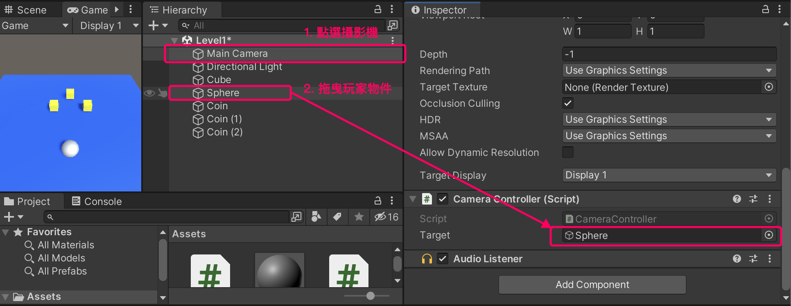
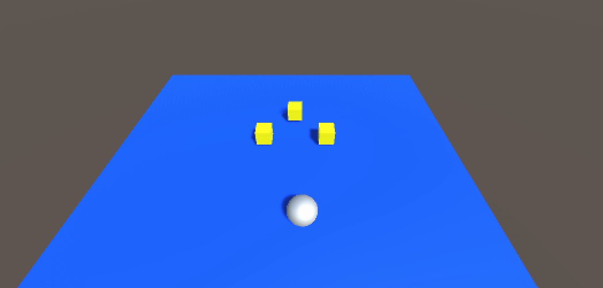

# 簡易 Script 控制攝影機跟隨

這邊介紹一種簡易的方式，主要用於初學練習。實際在遊戲製作中建議使用 [Cinemachine](../cinemachine/)。

## 原理說明
攝影機腳本：
1. 開始遊戲時(Start)，計算出目前位置與玩家的座標差異，並把差異數存下來
2. 遊戲執行時(Update)，攝影機位置 ＝ 目前玩家位置＋差異數

## 攝影機 Script
1. 在攝影機(Main Camera) 上新增 Script，名為 CameraController
2. 寫入下方程式

```csharp
using System.Collections;
using System.Collections.Generic;
using UnityEngine;

public class CameraController : MonoBehaviour
{
    public GameObject target; // 追蹤的目標（在Unity中拖曳指定）
    private Vector3 offset; // 與目標的座標差異

    void Start()
    {
        // 遊戲開始時，先計算自己與目標的座標差異，並儲存起來
        offset = transform.position - target.transform.position;
    }

    void Update()
    {
        // 遊戲執行時，一直將自己座標設為：目標座標 + 差異數
        transform.position = target.transform.position + offset;
    }
}
```

## 指定玩家 GameObject
在攝影機的 Script 中有新增了一個 public 的 GameObject 類型變數，名叫 target，這代表我們可以透過 Inspector 視窗去指定 target 關聯的物件。

所以回到 Unity 並把玩家物件拖入 target 參數中



## 執行遊戲
