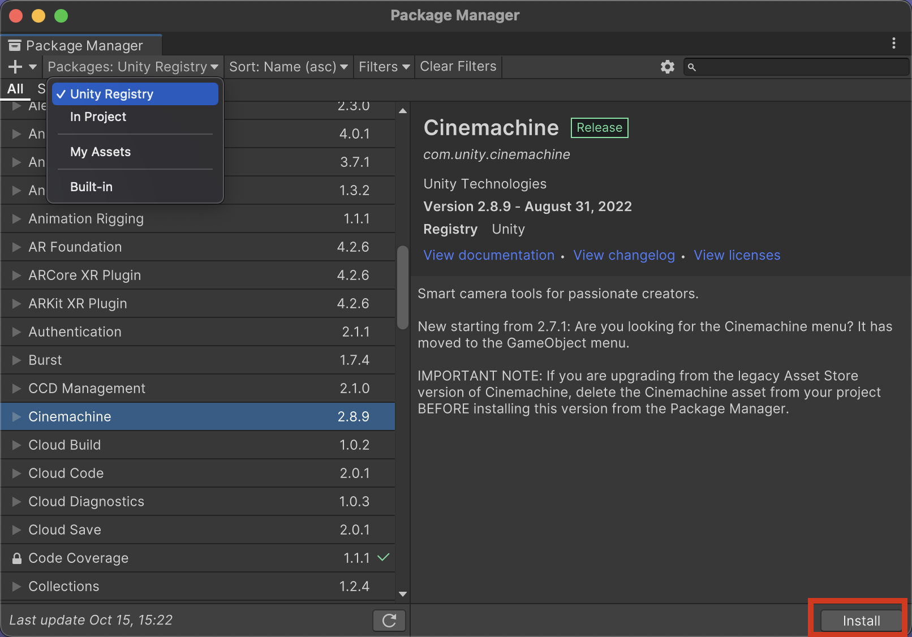
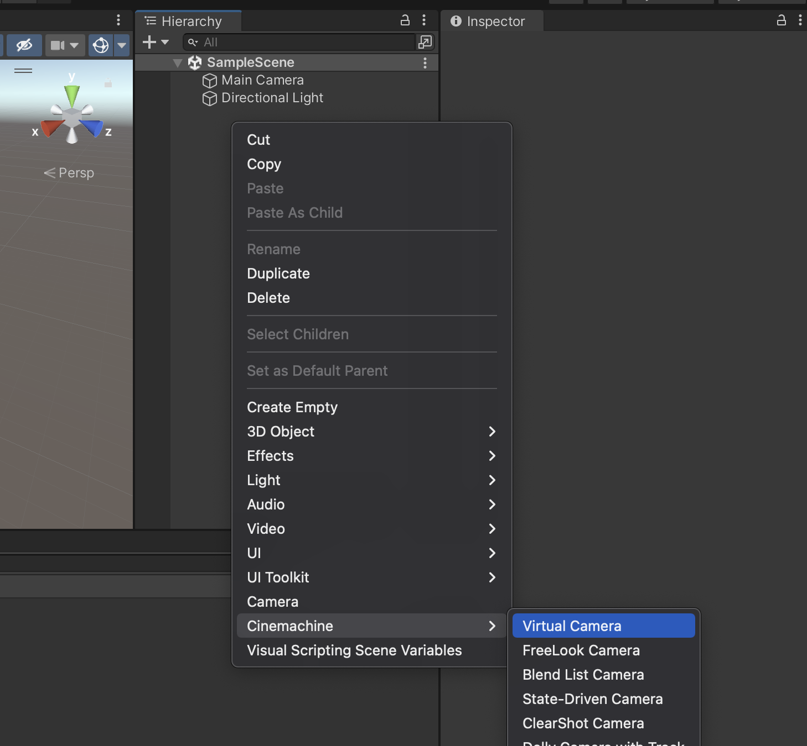
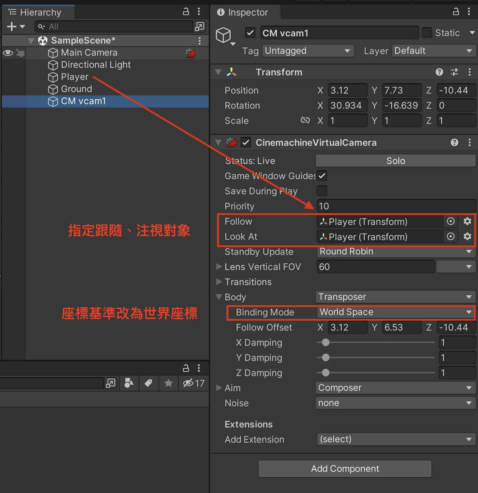
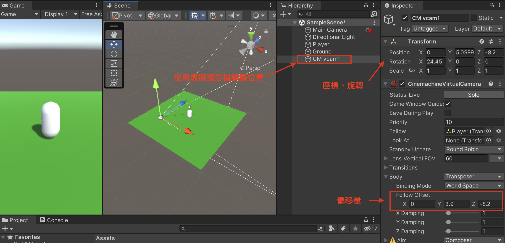
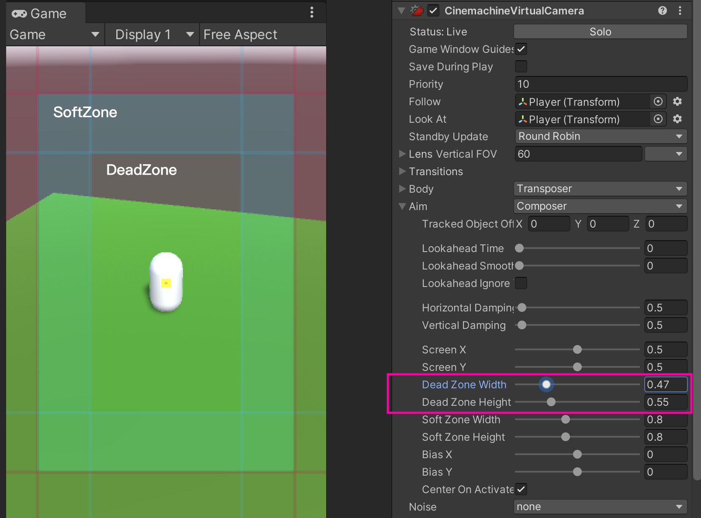

# Cinemahcine 攝影機跟隨
Cinemachine 是一個使用率極高的官方插件，各類型的遊戲攝影機都很適合使用。

## 安裝 Cinemachine 插件
1. 點選上方工具列 Window / Package Manager
1. 選擇 Unity Registry (官方插件)
1. 選取 Cinemachine
1. 按下右下角 Install 按鈕安裝至目前專案

## 新增虛擬攝影機
安裝後，回到 Hierarchy 視窗按下右鍵，就可以看到已經有了 Cinemachine 選項。
1. Hierarchy 視窗按下右鍵
1. 點選 Cinemachine / Virtual Camera

## 指定跟隨目標
1. 將要跟隨的物件，拖曳至 Follow 欄位
1. 並展開 Body、將 Binding Mode 改為 World Space (以世界座標為基準)

## 調整攝影機位置
將虛擬攝影機調整到適合位置，即可播放測試。

## 設定 Dead Zone
通常遊戲攝影機會有一個 Dead Zone，在此區域裡攝影機不用跟隨。這樣的視覺效果比較自然。

Cinemachine 預設 Dead Zone 的範圍是０，得透過調整 Aim / Dead Zone Width, Height 來設定。

|名稱|顏色|說明|
|---|---|---|
|Dead Zone|透明|不跟隨區域
|Soft Zone|藍色|漸進跟隨區域
|(無)|紅色|直接跟隨區域

