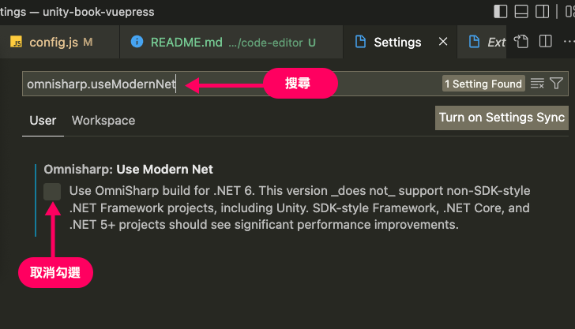
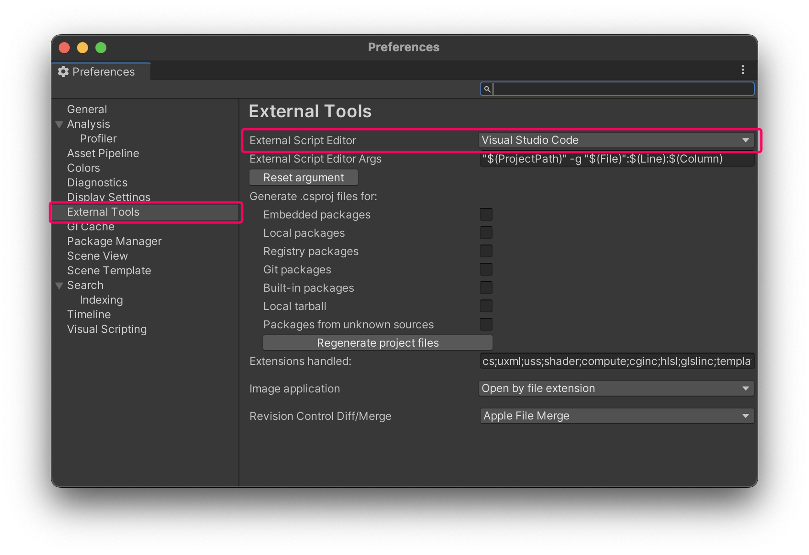

# 程式編輯軟體設定

## 為何不使用預設的 Visual Studio？
Unity 預設的程式編輯軟體是 Visual Studio，但該軟體較為龐大、許多狀態排除方式較為複雜。所以這邊建議初學者使用相對小巧快速的 Visual Studio Code，這也是本教學使用的編輯軟體。
:::tip Visual Stuio 和 Visual Studio Code 的關係？
這兩者同樣出自微軟，但是完全不同的兩個產品。前者是功能最全面、歷史悠久的軟體，也相對龐大；而 Visual Studio Code 近年才出現的輕盈編輯工具，優點是快速簡潔、有眾多插件可以使用，是近年來最熱門的程式編輯工具。
:::

## 步驟1：安裝 Visual Studio Code
至[官網下載](https://code.visualstudio.com/)並安裝。

## 步驟2：安裝 .NET SDK

### Windows 
1. 下載並安裝 [.NET SDK](https://dotnet.microsoft.com/download) （如果你已經安裝 Visual Studio 則不必再次安裝 .NET SDK）

### Mac
1. 下載並安裝 [.NET SDK](https://dotnet.microsoft.com/download)
1. 安裝 [Mono](https://www.mono-project.com/download/) 提供 Mac 環境使用 .NET

## 步驟3：安裝  Visual Studio Code 插件
開啟 Visual Studio Code 之後，選擇左側 Extensions 分頁，輸入搜尋下列插件名稱，並安裝。
| 插件名稱 | 說明 |
|:---:|:---:|
| C# | 提供 C# 語法提示、 .NET Core 的相關開發功能 |
| Unity Code Snippets | 提供 UnityEngine 的程式碼提示 |

## 步驟4：設定 omnisharp.useModernNet
1. 開啟設定畫面 (Preference / Settings)
2. 搜尋：omnisharp.useModernNet
3. 並取消勾選

## 步驟5：Unity 指定 VS code 為程式編輯器
1. 回到 Unity
2. 開啟 Preference / External Tools
3. 把 External Script Tool 改為 Visual Studio Code

以後在 Unity 中點選 script 檔案兩下，就會自動開啟 VS Code 了！