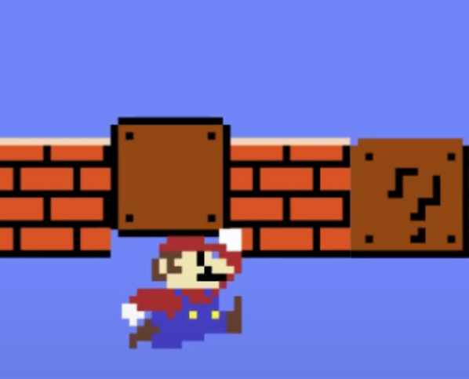
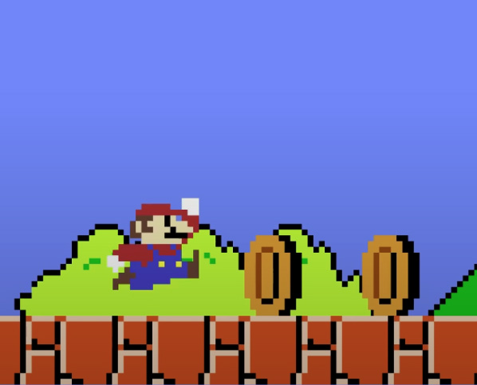

# Unity 中的碰撞

## 兩種碰撞事件
當兩物件發生碰撞時，Unity 會觸發碰撞事件，在 Unity 中碰撞事件分為兩種：Collision 或者 Trigger。

依照遊戲需求，將其設定為適合的碰撞事件。

||Collision|Trigger|
|:---:|:---:|:---:|
|行為|碰撞|觸發器|
|被撞反應|反彈|穿透過去|
|常見應用|門、牆壁、巨石、寶箱|金幣、子彈、開關、隱形觸發器|
||||