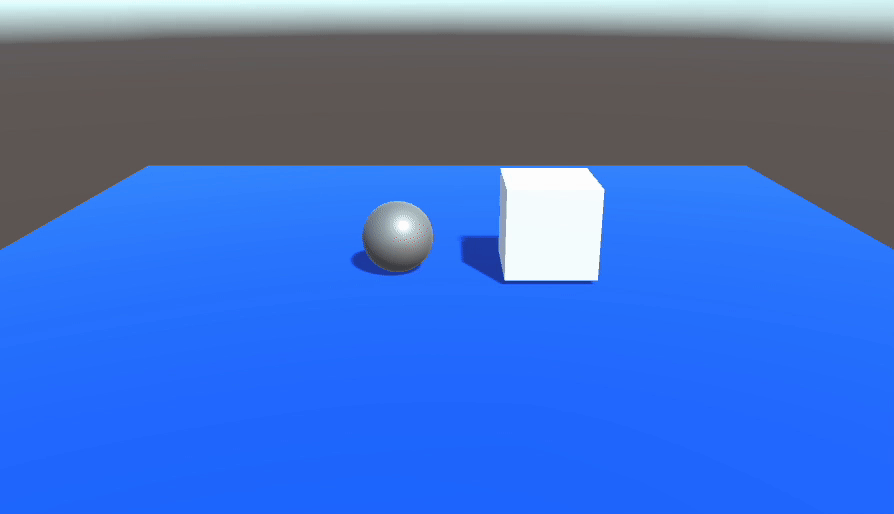

# Collision

當滿足下面兩項條件，且兩物件相碰時，就會同時觸發兩物件自身的 OnCollision 系列事件。
1. **雙方都必需有 Collider 碰撞框元件**
2. **其中一方必須有 Rigidbody、或者 CharacterController**


```csharp
using System.Collections;
using System.Collections.Generic;
using UnityEngine;

public class Ball : MonoBehaviour
{
    void Start()
    {

    }

    void Update()
    {

    }

    private void OnCollisionEnter(Collision other)
    {
        // 這邊在碰撞"發生"時會執行一次
    }
    private void OnCollisionStay(Collision other)
    {
        // 這邊在碰撞"持續貼著時"時會持續執行
    }
    private void OnCollisionExit(Collision other)
    {
        // 這邊在碰撞"結束"時會執行一次
    }
}
```


## 範例

下面範例是用顏色表現碰撞事件觸發時機。

由於地板也屬於可觸發碰撞的物件，所以在碰撞時，使用名稱判斷是否為地板（地板物件需命名為 "Ground"）。



```csharp
using System.Collections;
using System.Collections.Generic;
using UnityEngine;

public class Ball : MonoBehaviour
{
    Rigidbody rb;
    void Start()
    {
        rb = GetComponent<Rigidbody>();
    }

    void FixedUpdate()
    {
        // 取得操控方向
        float h = Input.GetAxis("Horizontal");
        float v = Input.GetAxis("Vertical");

        // 合成為向量，並且推動
        Vector3 dir = new Vector3(h, 0, v);
        Vector3 move = dir.normalized * 100 * Time.deltaTime;
        rb.AddForce(move);
    }

    private void OnCollisionEnter(Collision other)
    {
        // 碰撞發生時，將自身顏色改為紅色
        // (但因為下一個 frame 就會執行 OnCollisionStay 而改為綠色
        // 所以紅色的時間只有 1/30秒，通常看不到）
        if (other.gameObject.name != "Ground")
        {
            GetComponent<MeshRenderer>().material.color = Color.red;
        }
    }

    private void OnCollisionStay(Collision other)
    {
        // 兩物件持續貼著時，將顏色改為綠色
        if (other.gameObject.name != "Ground")
        {
            GetComponent<MeshRenderer>().material.color = Color.green;
        }
    }

    private void OnCollisionExit(Collision other)
    {
        // 兩物件的碰撞結束後，將顏色改為灰色
        if (other.gameObject.name != "Ground")
        {
            GetComponent<MeshRenderer>().material.color = Color.gray;
        }
    }
}

```