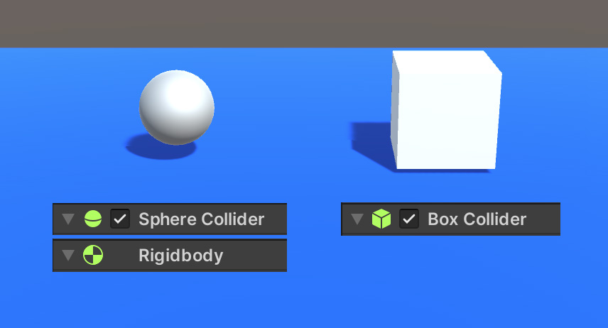

# Collision

當滿足下面兩項條件，且兩物件相碰時，就會同時觸發兩物件自身的 OnCollision 系列事件。
1. **雙方都必需有 Collider 碰撞框元件**
2. **其中一方必須有 Rigidbody、或者 CharacterController**



```csharp
using System.Collections;
using System.Collections.Generic;
using UnityEngine;

public class Ball : MonoBehaviour
{
    void Start()
    {

    }

    void Update()
    {

    }

    private void OnCollisionEnter(Collision collision)
    {
        // 這邊在碰撞"發生"時會執行一次
    }
    private void OnCollisionStay(Collision collision)
    {
        // 這邊在碰撞"持續貼著時"時會持續執行
    }
    private void OnCollisionExit(Collision collision)
    {
        // 這邊在碰撞"結束"時會執行一次
    }
}
```

## 回傳參數 collision 的作用
OnCollision 系列的事件會傳入碰撞資訊 collision，這個參數非常有用，可以需要透過它來取得碰撞相關的各種資訊。
```csharp
private void OnCollisionEnter(Collision collision)
{
    collision.collider // 對方的 collider
    collision.gameObject // 對方的 gameObject
    collision.gameObject.tag // 對方的 tag
    collision.rigidbody  // 對方的 rigidbody
    collision.transform // 對方的座標（等於 collision.gameObject.transform）

    // 取得第一個碰撞點座標
    Vector3 p = collision.GetContact(0).point;
}
```

## 範例：碰撞到敵人產生擊中特效

```csharp
private void OnCollisionEnter(Collision collision)
{
    // 碰撞到敵人
    if (collision.gameObject.tag == "Enemy")
    {
        // 取得碰撞點座標
        Vector3 p = collision.GetContact(0).point;

        // 產生特效物件到碰撞點座標上，0.5秒後刪除
        GameObject vfx = Instantiate<GameObject>(<<特效物件>>, p, Quaternion.identity);
        Destroy(vfx, 0.5f);

    }
}
```

## CharacterController 的碰撞
CharacterController 並沒有上述的 OnCollision 系列事件，只能使用另一個叫做 OnControllerColliderHit 的事件來處理。
:::tip 注意
OnControllerColliderHit 是在兩物件有接觸就會持續執行，行為上比較像 OnCollisionStay，如果想實現 Enter 和 Leave，則得自己透過程式邏輯去達成了。
::: 

```csharp
void OnControllerColliderHit(ControllerColliderHit hit)
{
    hit.collider // 對方的 collider
    hit.gameObject // 對方的 gameObject
    hit.moveDirection // 碰撞時 ControllerCollider 的行進方向（Vector3)
    hit.point // 碰撞點座標（Vector3)
}
```