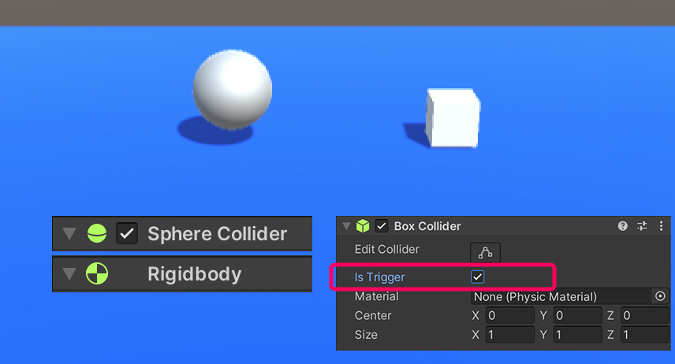
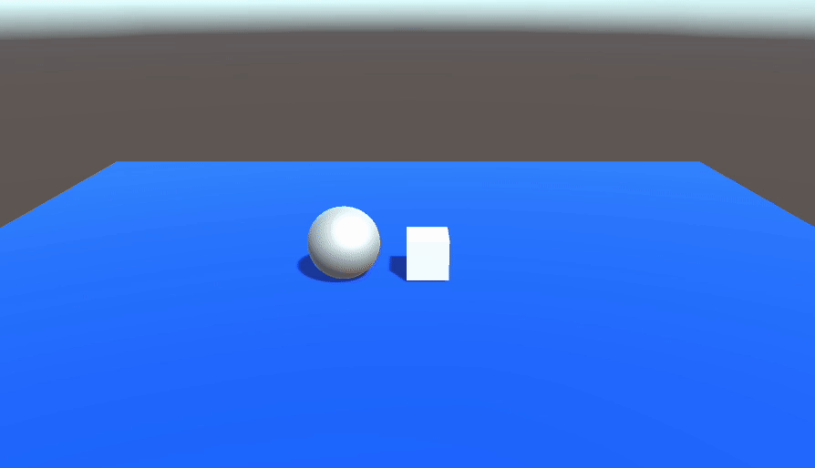

# Trigger

當滿足下面三項條件，且兩物件相碰時，兩物件就會同時觸發自身的 OnTrigger 系列事件。
1. **雙方都必需有 Collider 碰撞框元件**
2. **其中一方必須有 Rigidbody、或者 CharacterController**
3. **且其中一方的 Collider 元件有勾選 Is Trigger** (通常是金幣、開關)




```csharp
using System.Collections;
using System.Collections.Generic;
using UnityEngine;

public class Ball : MonoBehaviour
{
    void Start()
    {

    }

    void Update()
    {

    }

    private void OnTriggerEnter(Collider other) 
    {
        // 這邊在"兩物件產生交疊"時會執行一次
    }

    private void OnTriggerStay(Collider other) 
    {
        // 這邊在"兩物件交疊"時會持續執行
    }

    private void OnTriggerExit(Collider other) 
    {
        // 這邊在"兩物件離開交疊"時會執行一次
    }
}
```

## 範例



```csharp
using System.Collections;
using System.Collections.Generic;
using UnityEngine;

public class Ball : MonoBehaviour
{
    Rigidbody rb;
    void Start()
    {
        rb = GetComponent<Rigidbody>();
    }

    void Update()
    {
        float h = Input.GetAxis("Horizontal");
        float v = Input.GetAxis("Vertical");

        Vector3 dir = new Vector3(h, 0, v);
        Vector3 move = dir.normalized * 100 * Time.deltaTime;

        rb.AddForce(move);
    }

    private void OnTriggerEnter(Collider other)
    {
        // 當物件開始交疊時，執行一次
        // 將自身顏色改為紅色
        // (由於接著會執行 OnTriggerStay
        // 到了算圖時，球體已經設為綠色，所以並不會看見紅色)
        if (other.gameObject.name == "Box")
        {
            GetComponent<MeshRenderer>().material.color = Color.red;
        }
    }
    private void OnTriggerStay(Collider other)
    {
        // 當兩物件交疊時，持續執行
        // 將自身顏色改為綠色
        if (other.gameObject.name == "Box")
        {
            GetComponent<MeshRenderer>().material.color = Color.green;
        }
    }
    private void OnTriggerExit(Collider other)
    {
        // 當兩物件不再交疊時，執行一次
        // 將自身顏色改為灰色
        if (other.gameObject.name == "Box")
        {
            GetComponent<MeshRenderer>().material.color = Color.gray;
        }
    }
}

```

:::tip
大多數金幣、開關都是單獨使用 OnTriggerEnter 居多。

少數情況下才會使用另外兩個，例如：人物站在火堆中會持續扣血，就適合使用 OnTriggerStay
:::