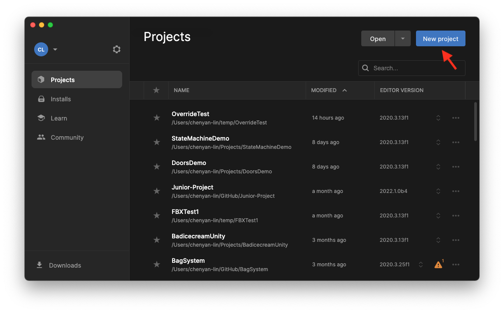
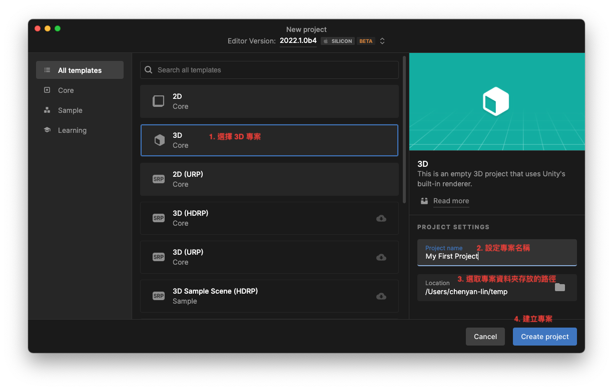
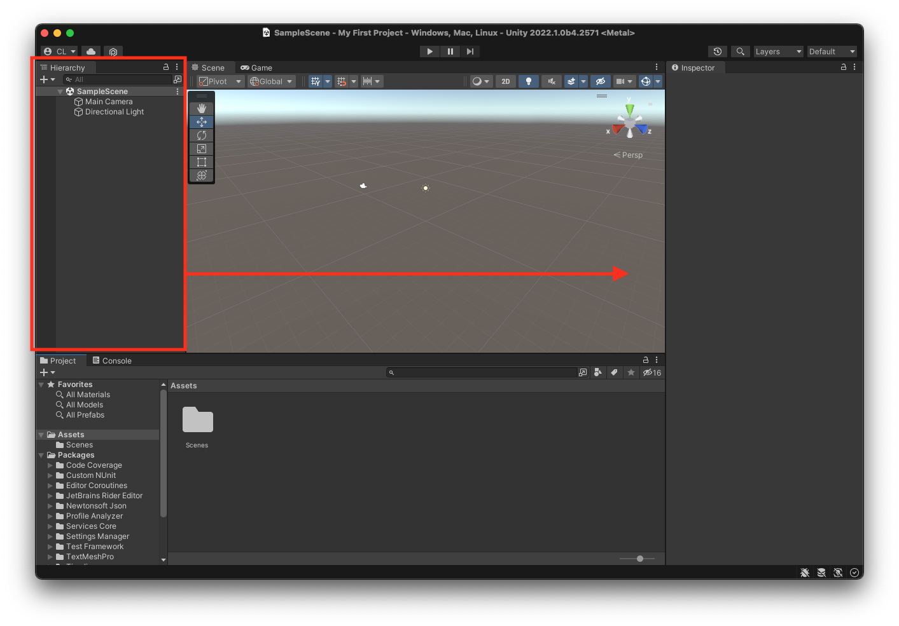

# 建立專案

## 使用 Unity Hub 建立新專案
開啟 Unity Hub 之後按下 New project 按鈕。

::: tip Unity Hub
是用來管理 Unity 版本與專案的小程式，並不是 Unity。
:::

1. 選擇 3D 專案
1. 設定專案名稱
1. 選擇專案資料夾存放的路徑
1. 按下 Create Project 

此時Unity 就會啟動並開始產生遊戲專案。等一小段時間後，就會看見 Unity 成功開啟了。

::: tip 
為了之後編輯方便，建議每次開啟 Unity 的第一件事，就是把 Hierarchy 面板，用滑鼠拖曳到右邊，靠著 Inspector 視窗。
:::

舒適的空白專案大功告成！