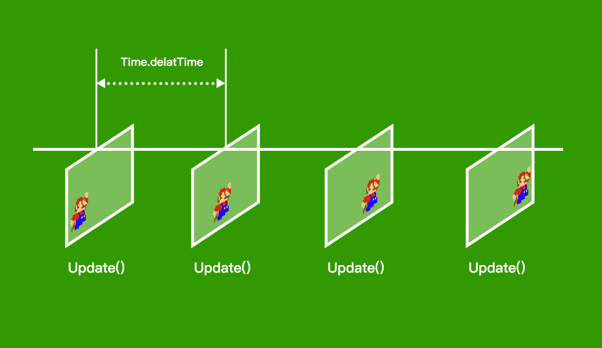
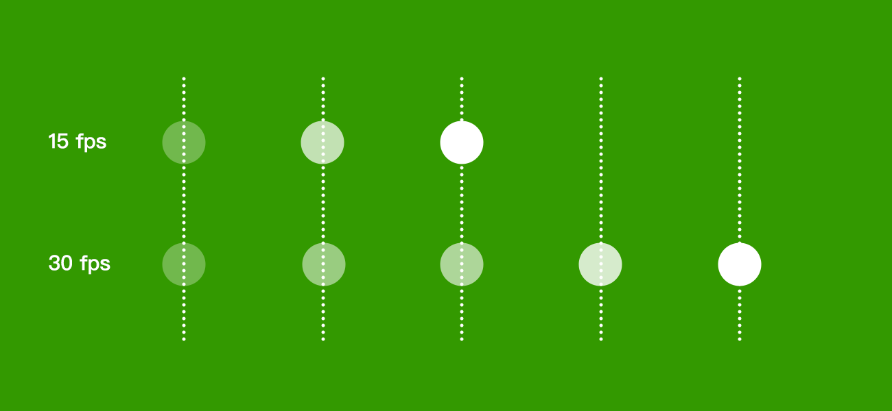
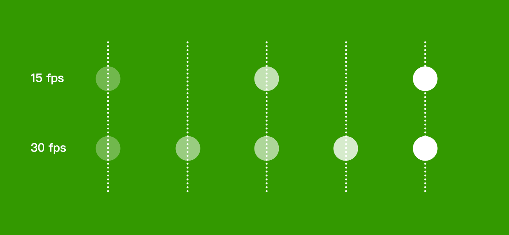

# Time.deltaTime
Time.deltaTime 會取得每個遊戲 Update() 之間的秒數。



由於 Update 的執行頻率(fps) 會依電腦速度有所差異，所以在較好的電腦上可以穩定執行 30fps，也就是每秒執行 30 次 Update()；而電腦運算較弱的情況，可能只有 10fps，也就是每秒執行 10 次 Update()。

- 在 30fps 時：<br/>Time.deltaTime = 1 / 30 = **0.0333..**

- 在 15fps 時：<br>Time.deltaTime = 1 / 15 = **0.0666..**


## 未使用 Time.deltaTime 的情況：

在 Update() 裡使用 Translate 來移動角色，固定移動速度為 0.1。



```csharp
void Update()
{
    transform.Translate(0, 0, 0.1f);
}
```
|FPS|每個Update走的距離|每秒走的距離|
|---|---|---|
|30|0.1|30 * 0.1 = 3|
|15|0.1|15 * 0.1 = 1.5|


## 使用 Time.deltaTime 達成一致：
使用 Time.deltaTime，在較低 fps 的狀態下，每一步的移動距離會變大。

```csharp
void Update()
{
    transform.Translate(0, 0, 10 * Time.deltaTime);
}
```
|FPS|每個Update走的距離|每秒走的距離|
|---|---|---|
|30|10 * 0.0333 = 0.333|30 * 0.333 = 9.99|
|15|10 * 0.0666 = 0.666|15 * 0.666 = 9.99|

:::tip
通常在 Update 裡面有改變距離時，都需要乘上 Time.deltaTime 才對。
:::

[官方文件 Time.delatTime](https://docs.unity3d.com/ScriptReference/Time-deltaTime.html)