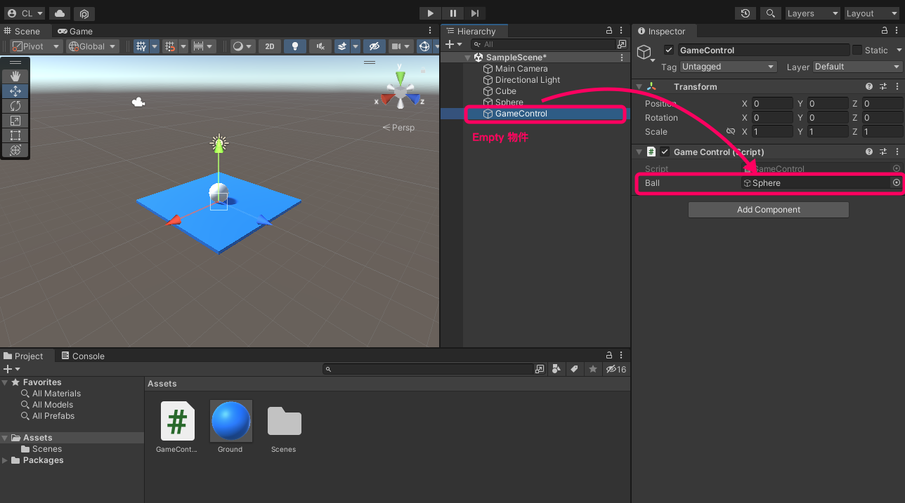

# 複製方法說明
複製物件在遊戲中是很常見的動作，例如：子彈、怪物生成、...。 Unity 中複製物件的方式是透過 Instantiate 這個函式來達成的。

## Instantiate 用法
Instantiate 有好幾種寫法，下面列出幾種常見的：

```csharp
// 在原地複製
Instantiate(來源物件);

// 複製後並指定坐標、旋轉
Instantiate(來源物件, 生成座標, 旋轉);
```

:::tip  回傳類型
由於 Instantiate 回傳的類型預設為最基礎 C# Object，如果要利用複製出來的物件進行其他操作，就必須轉型為 Unity 常用的 GameObject 或自訂類別。

所以複製時建議統一採用下面的做法：
:::

```csharp
// 複製後並指定坐標、旋轉，並且指定回傳的類別
Instantiate<類別>(來源物件, 生成座標, 旋轉);
```

## 範例：按下空白鍵產生
- 新增一個空白 3D 專案。
- 建立地板與球體。
- 在球體上增加 Rigidbody 元件。
- 建立一個 Empty 空物件，改名為 GameControl，並對其增加下方 Script。
- 將球體拖曳指定到 GameControl 的 ball 參數中。



```csharp
using System.Collections;
using System.Collections.Generic;
using UnityEngine;

public class GameControl : MonoBehaviour
{
    public GameObject ball; // 來源物件 (從 Unity 中拖入指定)

    void Start()
    {

    }

    void Update()
    {
        // 按下空白鍵
        if (Input.GetKeyDown(KeyCode.Space))
        {
            // 複製球體、生成位置在 (0,5,0)、旋轉方向為0
            GameObject newBall = Instantiate<GameObject>(ball, new Vector3(0, 5, 0), Quaternion.identity);

            // 隨機推動複製出來的球
            Rigidbody rb = newBall.GetComponent<Rigidbody>();
            float rx = Random.Range(-0.2f, 0.2f);
            float ry = Random.Range(-0.2f, 0.2f);
            float rz = Random.Range(-0.2f, 0.2f);
            rb.AddForce(rx, ry, rz);
        }
    }
}
```

