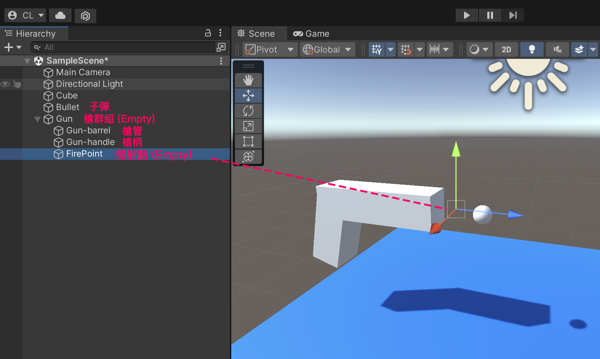
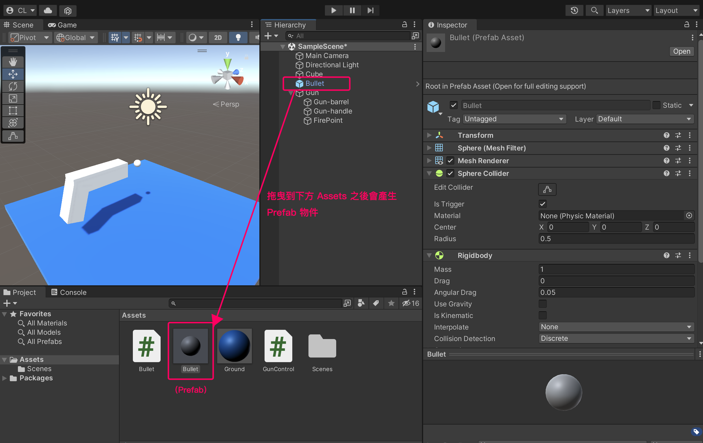
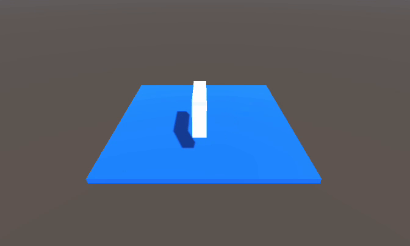
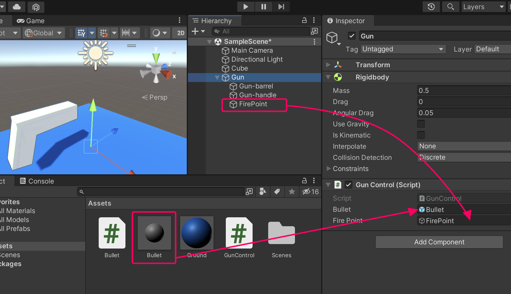
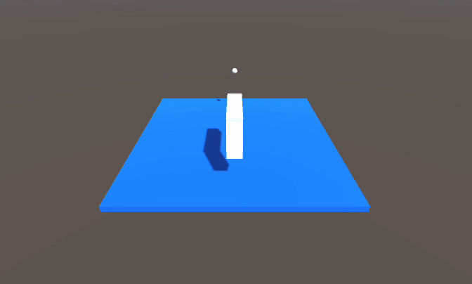

# 子彈射擊

- 在場景上製作一支手槍造型，與一個子彈。
- 建立一個 Empty 放在手槍的槍口處，當作之後子彈發射的參考位置，並改名為 FirePoint




## 讓子彈飛
- 勾選 Is Trigger （因為不想讓子彈碰撞時產生反彈）
- 子彈上加入 Rigidbody （因為我們要用物理的力去推動子彈）
- 取消 Use Gravity （因為要讓子彈直線飛，不考慮地心引力）


- 在子彈身上加入 Script 名為 Bullet.cs
```csharp
using System.Collections;
using System.Collections.Generic;
using UnityEngine;

public class Bullet : MonoBehaviour
{
    Rigidbody rb;
    float lifeTime = 0; // 計時秒數

    void Start()
    {
        // 設定一個持續的方向力，往面對方向（forward = +z)
        rb = GetComponent<Rigidbody>();
        rb.velocity = transform.forward * 100;
    }

    void Update()
    {
        // 計時三秒後刪除
        lifeTime += Time.deltaTime;
        if (lifeTime > 3)
        {
            Destroy(gameObject);
        }
    }
}

```

## 將子彈做成 Prefab
把子彈物件從物件清單視窗，拖曳到資源視窗中，這樣就會建立一個 Prefab (共用資源物件)，這樣做即使子彈不在場景上，也可以指定這個 Prefab 來做事。可以避免來源子彈消失後無法複製的窘境。

建立好 Prefab 後場景上的子彈就可以刪除了，以後就使用資源視窗中的即可。




## 槍身控制
在槍群組增加 Script 名為 Gun.cs。

我們要讓槍身會依照方向鍵左右移動，下面使用 Rigidbody 的 velocity 來實作移動：

```csharp
using System.Collections;
using System.Collections.Generic;
using UnityEngine;

public class GunControl : MonoBehaviour
{
    Rigidbody rb;

    void Start()
    {
        rb = GetComponent<Rigidbody>();
    }

    void Update()
    {
        // 用方向鍵左右移動槍
        float h = Input.GetAxis("Horizontal");
        rb.velocity = new Vector3( h * 5f,  0,  0);
    }
}
```


:::tip velocity 與 AddForce
Unity 會計算所有作用力，最後得出一個剛體的 velocity (速率) 才進行移動。所以 AddForce 只是往剛體上添加一個力而已。

velocity 也可以直接被指定，這樣的方式會帶來**更好的操控度**，但也等同忽略了其他作用力，如果需要與其他物件較多互動時，建議還是以 AddForce 為主要移動方式為佳。
:::

## 發射子彈
這邊我們加入按下空白鍵事件。按下時，會產生一個新的子彈，放在發射點(FirePoint)的位置上。
所以我們必須並且宣告兩個 public GameObject 變數用來對應，子彈和發射點物件。

由於子彈本身已經有射出的行為，所以我們複製它了以後，它自己會發射。

```csharp
using System.Collections;
using System.Collections.Generic;
using UnityEngine;

public class GunControl : MonoBehaviour
{
    Rigidbody rb;
    float x = 0; // 用來記錄 x 位置的變數
    public GameObject bullet; // 子彈來源 (在Unity介面中拖入)
    public GameObject firePoint; // 發射參考點 (在Unity介面中拖入)

    void Start()
    {
        rb = GetComponent<Rigidbody>();
    }

    void Update()
    {
        // 當有左右方向輸入時
        float h = Input.GetAxis("Horizontal");
        if (h != 0)
        {
            // 目前位置 加上 方向量(-1~1) * 10
            x = x + h * 10 * Time.deltaTime;

            // 使用 Rigidbody 的 MovePosition 指定要移動到的明確座標
            rb.MovePosition(new Vector3(x, 0, 0));
        }

        // 當按下空白鍵
        if (Input.GetKeyDown(KeyCode.Space))
        {
            // 複製子彈到發射參考點上
            Instantiate(bullet, firePoint.transform.position, Quaternion.identity);
        }
    }
}

```

