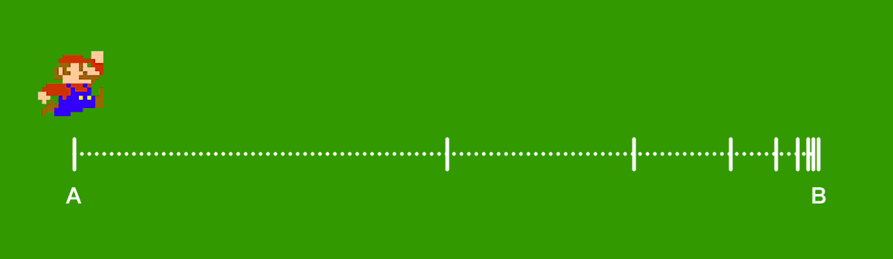

# Lerp 漸進移動

將 A點 帶入目前位置，就可以在每次 Update 以固定比例逐漸靠近 B點。

> Lerp(目前位置, 目標位置, 0.5f);



:::tip 無限接近，但卻達不到
雖然數字上不會真正達到 B 點，只會無限接近，但肉眼上與達到已無差異。
:::

```csharp
void Update()
{
    // 目標位置
    Vector3 targetPos = new Vector(10, 0, 15);

    // 漸漸移動到目標位置
    transform.position = Vector3.Lerp(transform.position, targetPos, 20 * Time.deltaTime);
}
```