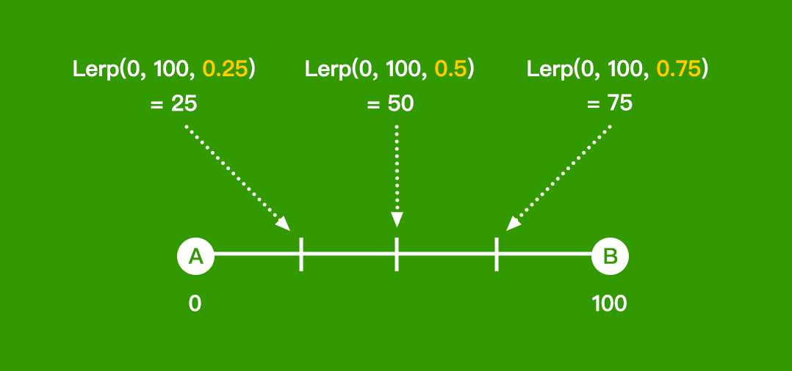

# Lerp 解說

採用漸進移動的方式可以讓物體行為較生動，Lerp 與 Tween 就是程式上達成漸進行為的兩種常用方式。

內建於 Unity 大多數的數值物件之中（Vector2, Vector3, Quaternion...)。 Lerp 的概念十分簡單，它可以依自訂比例在 Ａ 與 Ｂ 之間取一個中間值。



## 寫法

> Lerp(A, B, 比例T);

### float 
```csharp
float a = 0;
float b = 100;
Mathf.Lerp(a, b, 0.1f);  // return: 10
```

### Vector3
```csharp
// Vector3
Vector3 va = new Vector3(0, 0, 0);
Vector3 vb = new Vector3(10, 50, 100);
Vector3.Lerp(va, vb, 0.2f); // return: (2, 10, 20)
```

### Quaternion
```csharp
// Vector3
Quaternion qa = Quaternion.Euler(0, 0, 0);
Quaternion qb = Quaternion.Euler(20, 40, 60);
Quaternion.Lerp(qa, qb, 0.3f); // return: to Euler (6, 12, 18)
```