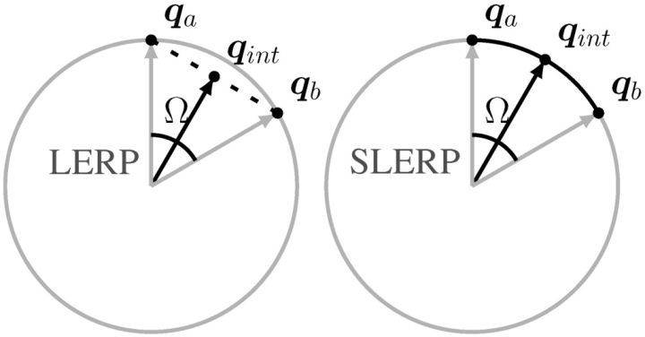

# Slerp 漸進轉向

## Lerp vs Slerp
Lerp 是兩點之間的“線性”插值，Slerp 則是是兩點之間的“弧線”插值。



在旋轉的動作上使用 Lerp 會出現一些不太順暢的速度差，改用 Slerp 則會較為順暢。

[深入說明影片: Lerping Fundamentals - Learn How to Use It & When to Use Its Variants | Unity Tutorial](https://youtu.be/IymDGkzwJts?t=367)

```csharp
void Update() 
{
    // 取得看向目標的轉向角度 (以 z 軸當前方)
    var tr = Quaternion.LookRotation(target.transform.position - transform.position);

    // 使用 Slerp 逐漸改變旋轉
    transform.rotation = Quaternion.Slerp(tr, targetRotation, 20 * Time.deltaTime);
}
```