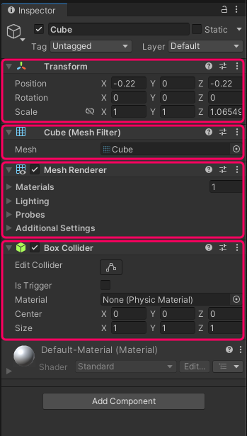
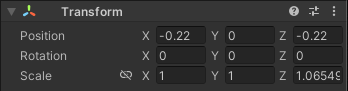
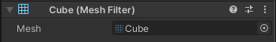
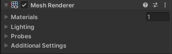
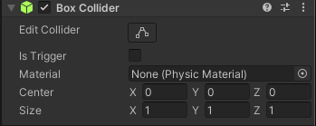

# 物件組成

在 Unity 之中常見的物件都是由一些"Component"(組件) 所組成的。即使是一個單純的立方體之中，也至少有四種 Component。這些都可以在選取物件時，透過 Inspector 面板看見其中的組件列表。 

讓我們先來快速瞭解一下這四個基礎的 Component。

## 基礎 Component
下面以一個立方體所預設的四種 Component 當例子來做介紹。

### Transform (變形)
定義了物件的位置、旋轉、縮放。

### Mesh Filter (造型定義)
用來定義多邊形造型，通常是由 3D 軟體製作後直接匯入，不太需要更動到此項目。

### Mesh Renderer (算圖效果)
掌管多邊形的算圖(顯示)顯示效果。

### (Box) Collider (碰撞框)
用來定義碰撞框的範圍，***是物理系統中實際用來判定範圍的東西***，在遊戲製作中有關鍵的作用。實際執行遊戲時 Collider 並不會被看見。

## 新增其他 Component
Unity 提供了非常多種類型的 Component，這些 Component 都提供了一些特殊的特性。可以藉由按下 Inspector 面板最下方的 Add Component 按鈕來自由新增。

我們將在其他章節中陸續使用其他 Component。