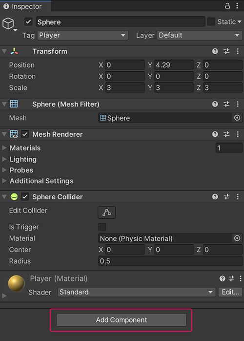
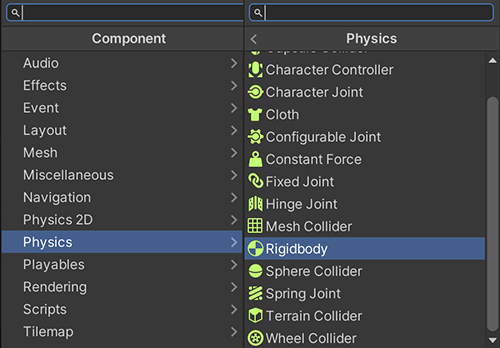
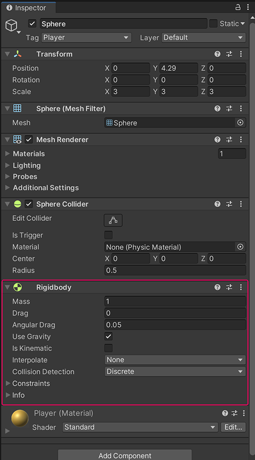
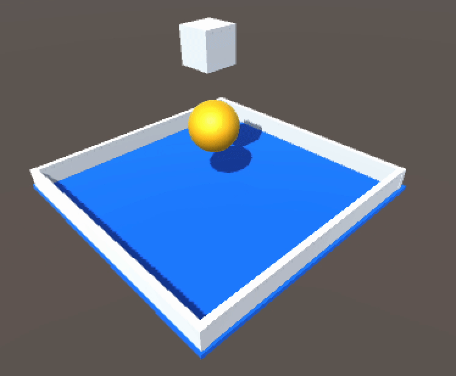

# 添加物理效果 Physics

上一章節的遊戲執行後，並不是很令人興奮。放在空中的物件並沒有落下來，那是因為在 Unity 中（和大部分的遊戲引擎）並沒有預設讓物件都具有物理效果。

現在我們就來手動為物件產生物理效果吧！方法十分簡單，只需要選取物件、在 Inspector 面板中按下 Add Component 新增元件。



這時選擇 Physics (物理) / Rigidbody (剛體)。




出現 Rigidbody 元件之後，該物件就具備物理效果了。把場景上需要物理的物件都加上 Rigidbody 元件後按下執行看看！ Physics（物理）的詳細說明會在後面的章節深入討論。



<!-- 
```csharp
using System.Collections;
using System.Collections.Generic;
using UnityEngine;

public class Coin : GridObject
{
    public float Speed = 100;
    private float ry = 0;

    void Start()
    {

    }

    void Update()
    {
        // 持續旋轉
        ry += Speed * Time.deltaTime;
        transform.rotation = Quaternion.Euler(0, ry, 0);
    }

    private void OnTriggerEnter(Collider other)
    {
        // 碰撞到玩家，消失
        if (other.tag == "Player")
        {
            Destroy(gameObject);
        }
    }
}

``` -->