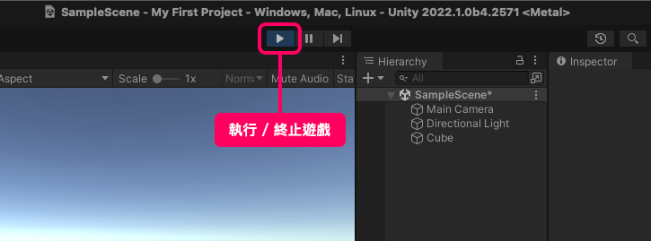
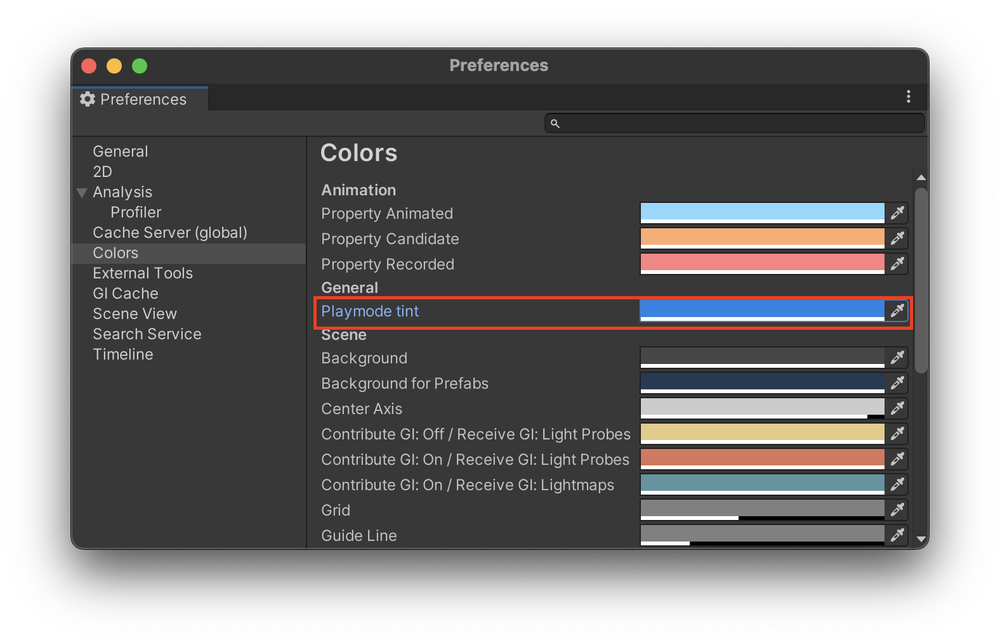

# 執行遊戲

當場景編輯告一段落，就可以按下畫面正上方的執行按鈕，來觀看實際遊戲畫面。原本 Scene 面板會切換成 Game 面板。

- Sence 面板：用來編輯場景。
- Game 面板：透過主攝影機看到的遊戲畫面。

不管遊戲是否執行，都可以隨時切換兩個面板。但只有執行時才會運行程式的部分。

::: warning
執行遊戲時對物件的任何修改，都會在結束執行時恢復到執行前的狀態。所以任何執行時的編輯都只是暫時的。
:::

## 執行模式遮罩
由於執行遊戲時容易忘記當前還在執行模式，而造成修改了一堆參數後，離開執行模式就全消失。所以在 Unity 有個設定可以避免上述的情況。

在 Preference / Colors 裡有一個 Playmode Tint，通過修改此顏色參數，可以讓執行遊戲時，Unity畫面自動蓋上一層顏色遮罩，讓人一看就清楚現在是執行模式。 

上圖設定 Playmode 為藍色。

執行遊戲後，Unity 介面都會呈現藍色。