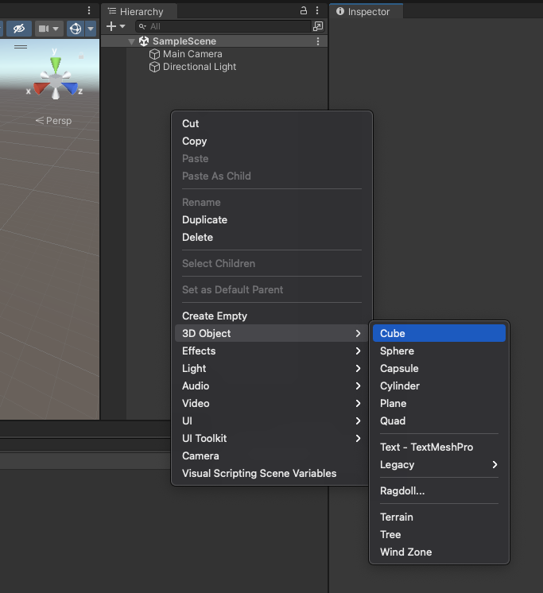
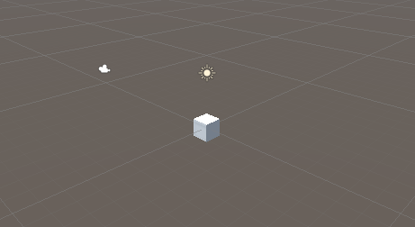

# 新增物件

## 新增立方體
讓我們在 Unity 的世界中建立一個立方體吧。
在 Hierarchy 面板中空白處按下滑鼠右鍵，選擇 3D Object / Cube，在場景上就會出現一個立方體。也可以嘗試看看其他圖形。

::: tip 基礎物件
| 英文名稱 | 造型 |
| --- | --- |
| Cube | 立方體 |
| Sphere | 球體 |
| Capsule | 球體 |
| Cylinder | 圓柱體 |
| Plane | 平面 |
:::

先別急著建立物件，先下一步讓我們來編輯這個物件。