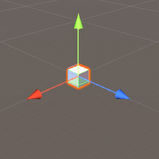
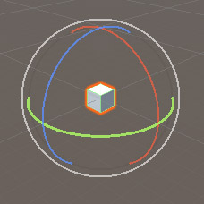
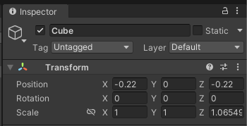
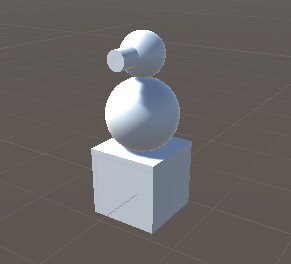

# 物件編輯
場景上有物件之後，就可以開始嘗試基礎操作。

## 基本操作
改變物件有三種基本的操作：移動、旋轉、縮放。各自對應了鍵盤上的 W、E、R，按其中之一就會出現相應的控制器，可以個別對三個軸向操作。

|移動|旋轉|縮放|
|:---:|:---:|:---:|
|Translate|Rotate|Scale|
|W|E|R|
|||
|tranform.position|tranform.rotation|tranform.scale|

在移動/旋轉/縮放物件時，可以同時觀察右邊 Inspector 視窗裡的 Transform 組件參數，相應的參數也會即時改變。所以使用 Inspector 面板輸入參數也可以達到同樣的改變。

## 軸向
以上的移動、旋轉、縮放，都是以固定的軸向操作，在 Unity 中可以切換兩種軸向：本地軸向(Local)、世界軸向(World)。依照使用狀況切換，讓編輯更方便。

::: tip 試試看

:::