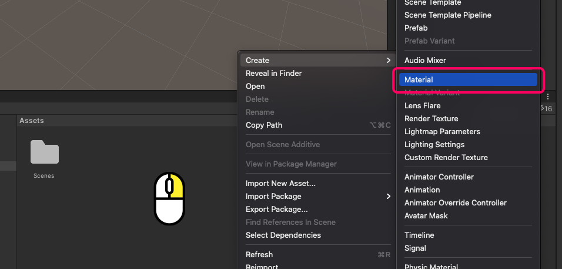
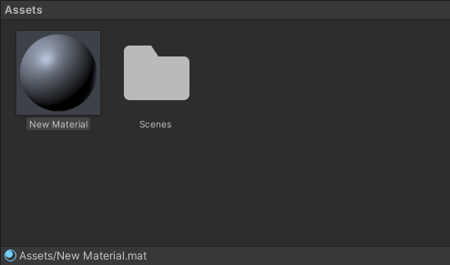
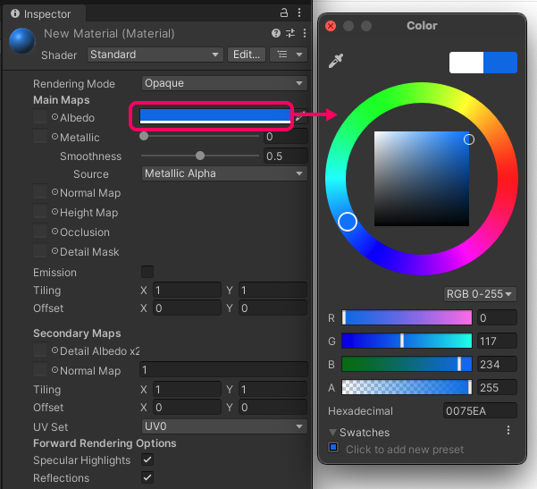
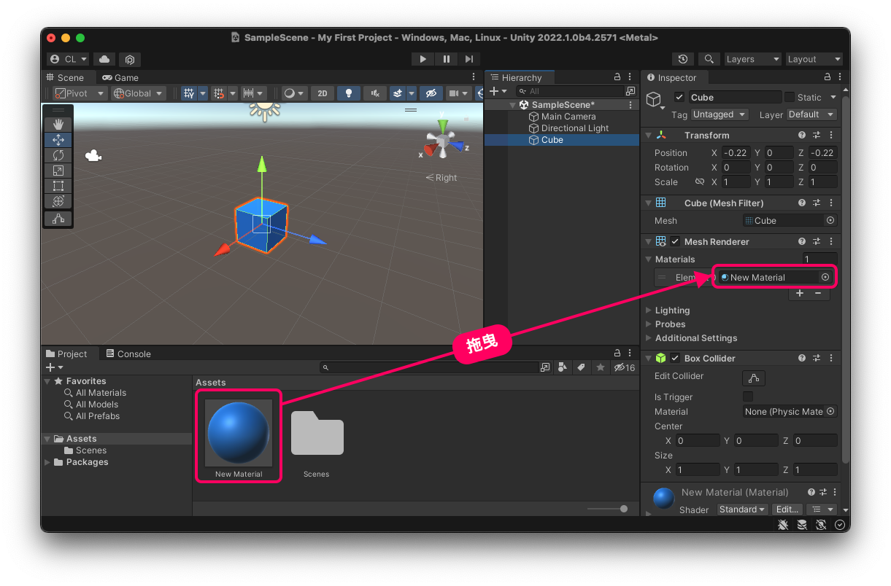
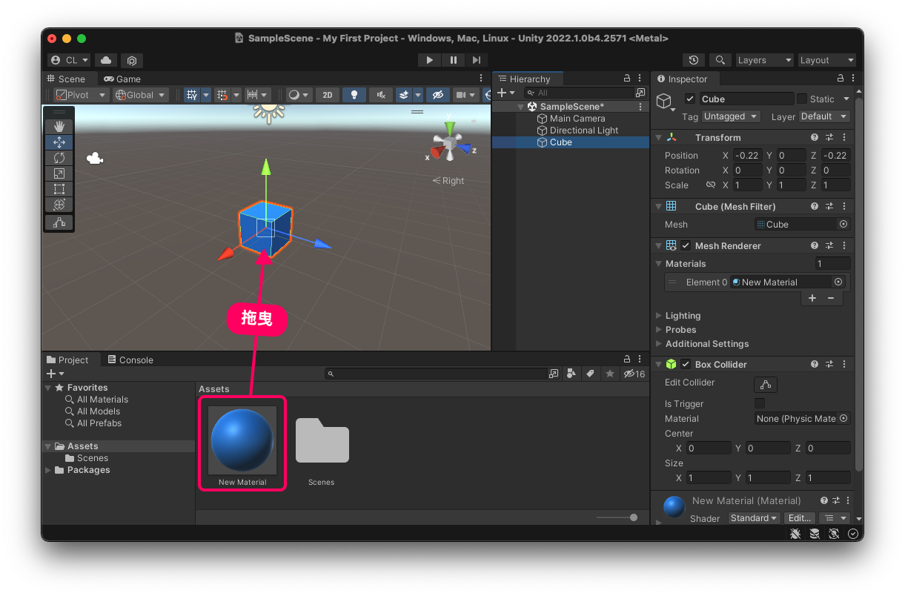

# 更換材質 (改變顏色)

在 Unity 中，想要為物件更換顏色，就必須透過賦予 Material(材質) 的方式來達成。

## 1. 新增材質檔案
在下方 Project 面板中按滑鼠右鍵 / Create / Material。

就會產生一個 New Material.mat 的檔案，名字可以自由更改。

## 2. 選擇顏色

點選剛才新增的 New Material，就可以在右邊 Inspector 面板中編輯顏色。

## 3. 將 Material 指定到物件上

將 Material 指定到物件上有兩種方法，兩者的結果完全一樣。

方法一比較能理解背後的關係，方法二則是方便的快速作法。

### 方法一：
先選取物件，並將 Inspector 面板中的 Mesh Renderer / Material 打開，然後將材質拖曳到 Element 0 輸入框裡。

::: tip
選取物件後，再選擇材質時，必須按下後直接拖曳到 Inspector 的欄位，不能"點選"材質，不然 Inspector 面板會改為呈現材質的內容。這是 Unity 時常使用的操作，需要適應一番。
:::

::: tip Mesh Renderer (多邊形彩現)
由此關係我們可以了解：材質並不是直接添加到物件上的，而是隸屬於物件下的 Mesh Renderer 內。Mesh Renderer 負責掌管多邊形物件顯示的 Component，用來控制材質、光影效果等等，所以材質要拖曳給它也是合情合理。
:::

### 方法二：

方法二是快速的方式，完成後可以觀察 Inspector 面板，會發現呈現如同方法一一樣的結果：材質被指定到 Mesh Renderer / Material / Element 0 之中。

指定好新材質之後，再改變顏色時，就可以在畫面中直接看到效果，不需要再重新指定。