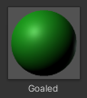
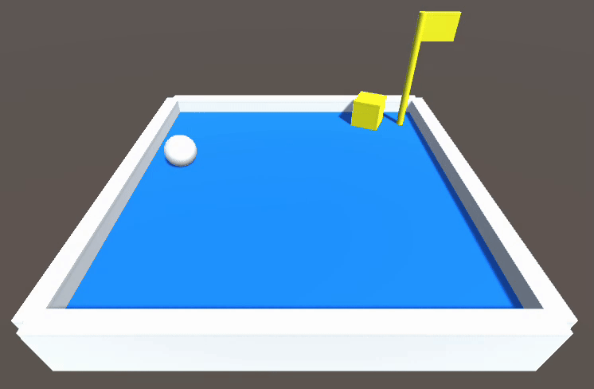

# 碰撞偵測
現在我們讓方塊碰到旗竿時，將旗竿改變為綠色。

## 步驟 1. 建立過關材質檔
在 Assets 面板中按右鍵，Create / Material 建立名為 Goaled 的材質檔，並修改為綠色。



## 步驟 2. 建立旗竿程式碼
選取旗竿後，增加名為 Goal.cs 的程式碼元件，修改內容如下：

```csharp
using System.Collections;
using System.Collections.Generic;
using UnityEngine;
public class Goal : MonoBehaviour
{
    public Material goaledMat; // 過關材質

    void Start()
    {

    }

    void Update()
    {

    }

    // 當碰撞發生時，會執行的函數
    private void OnCollisionEnter(Collision other)
    {
        // 如果碰撞的物件名為 PlayBox
        if (other.gameObject.name == "PlayBox") 
        {
            // 把自身的材質更換為過關材質
            MeshRenderer mr = GetComponent<MeshRenderer>();
            mr.material = goaledMat;
        }
    }
}

```

## 步驟 3. 賦予過關材質

程式碼存檔後，回到 Unity 會看見旗竿的程式碼元件中，多了一個 Goaled Mat 的欄位。這時將 Assets 面板裡的過關材質拖曳進該欄位，之後程式碼就可以使用該材質了。


## 步驟 4. 執行看看
按下執行，讓方框碰撞到旗竿試試看，旗竿應該會更換顏色。


