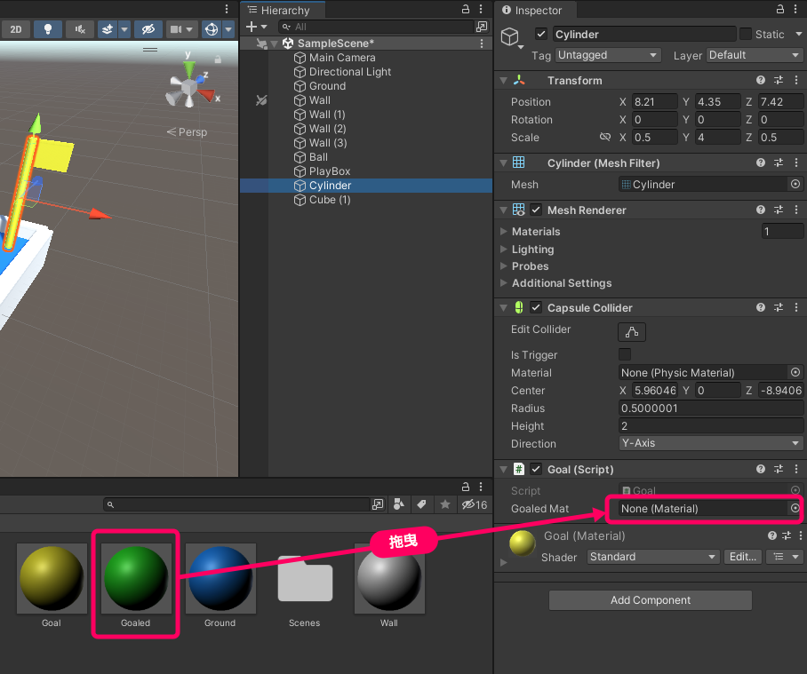

# 碰撞偵測
現在我們讓方塊碰到旗竿時，將旗竿改變為綠色。

## 步驟 1. 將方塊改名
因為碰撞時，我們打算用物件名稱來判斷碰到的對象，所以這邊先將方塊的名稱改為 PlayBox


## 步驟 2. 建立過關材質檔
在 Assets 面板中按右鍵，Create / Material 建立名為 Goaled 的材質檔，並修改為綠色。


## 步驟 3. 建立旗竿程式碼
選取旗竿後，增加名為 Goal.cs 的程式碼元件，修改內容如下：

```csharp
using System.Collections;
using System.Collections.Generic;
using UnityEngine;
public class Goal : MonoBehaviour
{
    public Material goaledMat; // 過關材質

    void Start()
    {

    }

    void Update()
    {

    }

    // 當碰撞發生時，會執行的函數
    private void OnCollisionEnter(Collision other)
    {
        // 如果碰撞的物件名為 PlayBox
        if (other.gameObject.name == "PlayBox") 
        {
            // 更換為過關材質
            MeshRenderer mr = GetComponent<MeshRenderer>();
            mr.material = goaledMat;
        }
    }
}

```

## 步驟 4. 賦予過關材質

程式碼存檔後，回到 Unity 會看見旗竿的程式碼元件中，多了一個 Goaled Mat 的欄位。這時將 Assets 面板裡的過關材質拖曳進該欄位，之後程式碼就可以使用該材質了。

:::tip Public 欄位
Unity 會自動把宣告為 Public 的屬性，以輸入元件的方式呈現在 Inspector 面板，方便開發人員直接修改參數。因此，通常需要在開發時反覆調整的參數，建議都宣告為 Public。 
:::



## 步驟 5. 執行看看
按下執行，讓方框碰撞到旗竿試試看，旗竿應該會更換顏色。


## 再完美一點
上面我們已經完成了碰撞偵測、動態更換材質。但如果碰撞時，旗幟與方塊也同時變成綠色就更完美了。

我們先在旗竿的 Goal 類別中，新增旗幟與方塊的屬性。

```csharp
using System.Collections;
using System.Collections.Generic;
using UnityEngine;
public class Goal : MonoBehaviour
{
    public Material goaledMat;
    public GameObject box; // 方塊
    public GameObject flag; // 旗幟

    // ...略...
}
```

回到 Unity 會看見旗竿的 inspector 視窗中出現了 box、flag 欄位。 

此時我們從 Hierarchy 視窗，將方塊和旗幟物件拖曳進去，此時我們就完成了指定 box、flag 兩屬性的指定對象。

接著我們再修改一下 OnCollisionEnter 函數：

```csharp
// 當碰撞發生時，會執行的函數
private void OnCollisionEnter(Collision other)
{
    // 如果碰撞的物件名為 PlayBox
    if (other.gameObject.name == "PlayBox")
    {
        // 更換為過關材質
        MeshRenderer mr = GetComponent<MeshRenderer>();
        mr.material = goaledMat;

        // 將旗幟更換為過關材質
        flag.GetComponent<MeshRenderer>().material = goaledMat;

        // 將方塊更換為過關材質
        box.GetComponent<MeshRenderer>().material = goaledMat;
    }
}
```


:::tip
```csharp
MeshRenderer mr = GetComponent<MeshRenderer>();
mr.material = goaledMat;
```
等同於
```csharp
GetComponent<MeshRenderer>().material = goaledMat;
```
前者有將 MeshRenderer 提出來存到變數再利用，這樣好處是 mr 可以重複利用，看起來也比較直觀；

後者則是取得 MeshRenderer 之後就直接使用，可以寫成單行。
:::