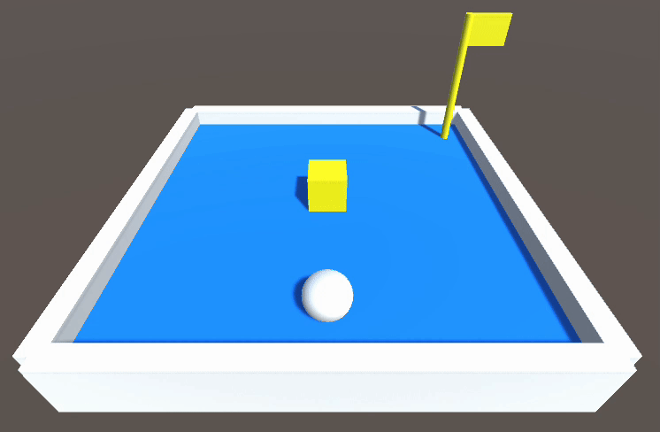

# 控制球體
這裡我們開始要新增程式碼了。程式碼對 Unity 物件來說，也是一種元件而已

開始遊戲時，場景上的元件會執行自己所擁有的 Script Component （程式碼元件）

## 新增程式碼元件
### 方法一：從物件新增
如同添加 RigidBody 的方式，選取物件後，在 Inspect 面板中點選 Add Component，並選擇最後一項 New script。輸入即將新增的檔名 Ball，按下 Create and Add，Unity 就會幫你在 Assets 資料夾中新增 Ball.cs 檔，並且賦予到當前物件裡。

### 方法二：先新增程式碼檔，再拖曳至物件
你也可以在 Assets 面板中，按右鍵 Create / C# Script 新增 Ball.cs 程式碼檔，選取 Ball 物件，並拖曳程式碼進 Inspect 面板之中。

### 編輯程式碼
只需要連點程式檔案兩下，Unity 便會自動開啟預設的程式編輯軟體。
:::tip 程式編輯軟體
請參考 程式編輯軟體設定，獲得更多說明。
:::

## Ball.cs
請將程式碼改寫為下列內容：

```csharp
using System.Collections;
using System.Collections.Generic;
using UnityEngine;

public class Ball : MonoBehaviour
{
    public float speed = 500.0f; // 速度
    private Rigidbody rb; // 用來存放剛體元件的變數

    void Start()
    {
        // 取得自身的剛體元件
        rb = GetComponent<Rigidbody>();
    }

    void Update()
    {
        // 取得方向鍵輸入
        float v = Input.GetAxis("Vertical");
        float h = Input.GetAxis("Horizontal");

        // 合成為方向向量、推動剛體
        Vector3 push = new Vector3(h, 0, v) * speed;
        rb.AddForce(push * Time.deltaTime);
    }
}
```

## 執行遊戲
存檔後回到 Unity，並按下執行，此時就可以使用方向鍵來控制球體了！

