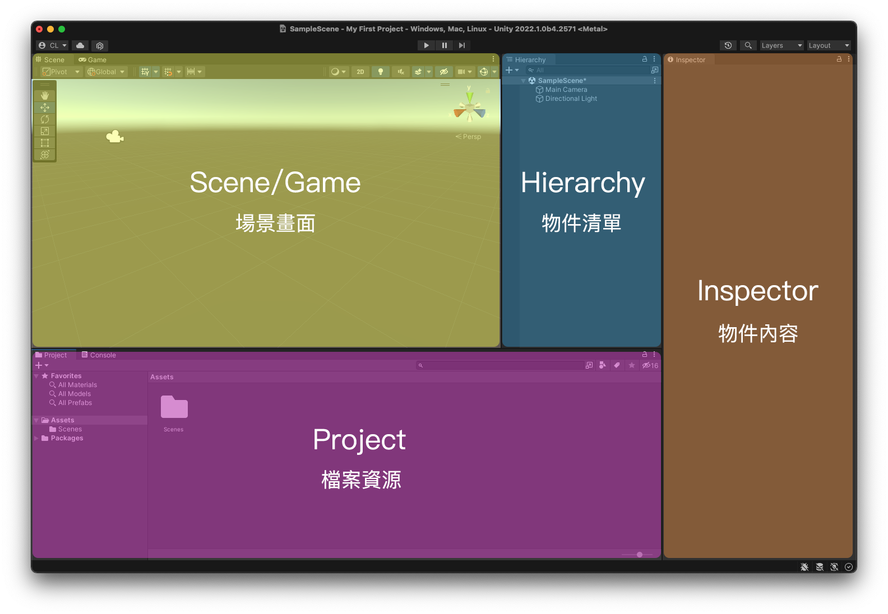
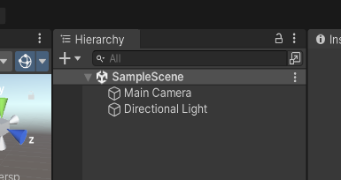
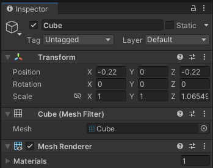
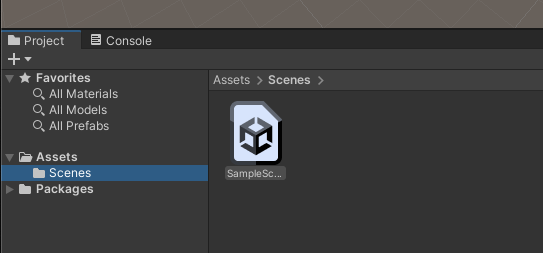

# 介面介紹

我們先來認識一下 Unity 畫面裡的各個區域的作用。

## Hierarchy (物件清單)
***Hierarchy 面板***，是當前場景中的"物件列表"，現在可以看到裡面已經裝有兩個預設的物件了，分別是：

- Main Camera：遊戲主攝影機，負責安排實際執行的遊戲畫面範圍。
- Directional Light：場景上的第一盞方向光。

## Inspector  (物件內容)

***Inspector 面板***，是用來顯示、編輯選取物件的細節內容。可以試著從 Hierarchy 面板中選取物件試試，Inspector 面板會依所選物件不同而顯示不同內容。這是之後最主要的編輯區。

## Project (檔案資源)
***Project 面板***，是顯示專案資源的地方，所有專案會用到的"檔案"都會呈現在此。

::: tip
現在已經有一個名叫 Assets 的資料夾，點兩下進去後會看見一個名叫 SimpleScene.unity 的場景檔案。這是 Unity 建立專案後一定會產生、並自動開啟的第一個場景，也就是目前畫面中顯示的場景。
:::

有了對一個專案的初步認識之後，我們可以開始動手建立一些物件了！