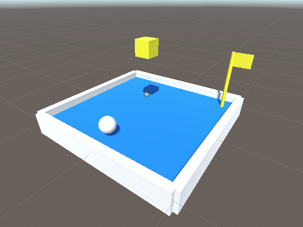
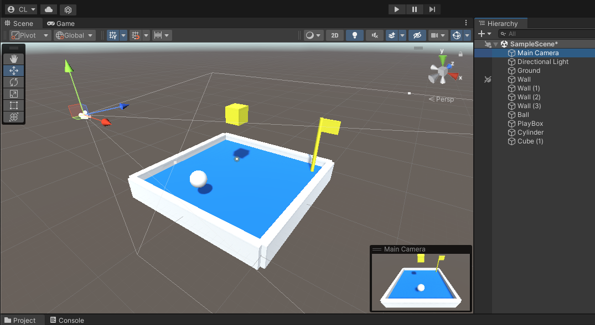
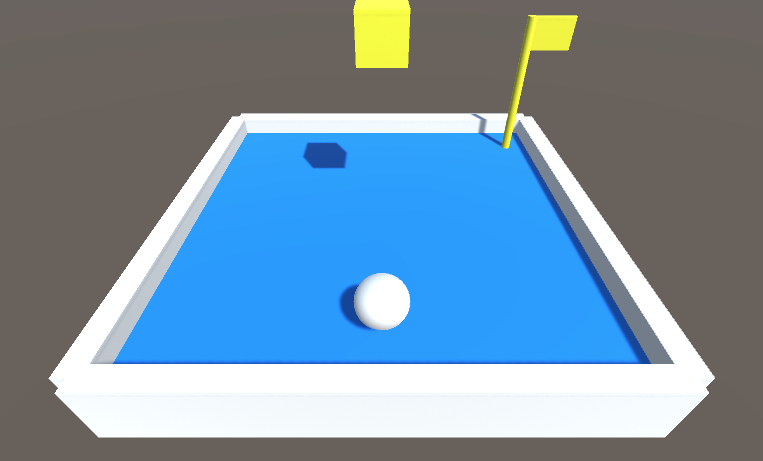

# 擺設遊戲畫面

利用之前的基礎操作，就可以開始用幾何多邊形來佈置遊戲場景。試試看佈置出下圖的樣子吧：

## 調整主攝影機

實際遊戲的畫面並不是編輯時用的 Scene 面板，而是透過場景上的主攝影機（Main Camera）看出去的畫面。想要調整遊戲畫面，就得控制場景上主攝影機的位置、角度，來擺設想要的遊戲畫面。

選取攝影機時，右下角會出現預覽小畫面；也可以切換到 Game 面板看到較大的遊戲畫面。

實際遊戲畫面，試著調整到下圖這樣的畫面吧。
