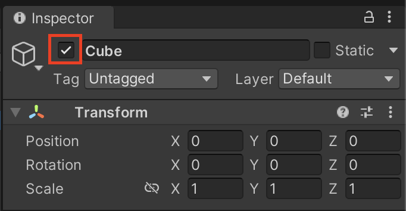

# 啟用與停用 SetActive

Unity 的物件都有 Active 這個屬性，當 Active 設為 true 時，它代表物件否可看得見、有作用，當設為 false 則相反。

:::warning 注意
Active 設為 false 的物件，雖然在遊戲中看不見、不會起作用，但他並沒有從場景中被實際刪除，只是暫時隱藏了起來，仍然佔有記憶體，等待著再被設回 true。
:::

:::tip 使用慣例
通常用於將物件"暫時"隱藏、啟用，方便隨時改變狀態，而不用重新產生。

例如：預先安排好、並等待時機出場的物件、防護罩、UI、輪流替換的物件(多個武器、裝備)。
:::

## 透過 Inspector 面板勾選


## 透過 Script 指定
### SetActive()
SetActive 是 GameObject 類別裡的方法，所以要先取得物件本身的 gameObject 才能對其啟用/停用。

```csharp
// 啟用
gameObject.SetActive(true);

// 停用
gameObject.SetActive(false);
```

[官方文件：GameObject.SetActive](https://docs.unity3d.com/ScriptReference/GameObject.SetActive.html)

## 取得目前 Active 狀態
### activeSelf
activeSelf 會回傳物件自身的 active 狀態。

:::warning 注意
在遊戲中的物件 Active 狀態也取決於父層是否啟用，所以即使 activeSelf 回傳為 true，仍有可能因其父層物件在停用中，而仍處於停用狀態。改用 activeInHierarchy 則可以取得物件實際上有沒有啟用。
:::

```csharp
bool isActived = gameObject.activeSelf;
```

[官方文件：GameObject.activeSelf](https://docs.unity3d.com/ScriptReference/GameObject-activeSelf.html)

### activeInHierarchy
有別於 activeSelf， activeInHierarchy 會回傳物件實際上在遊戲中是否真的啟用。而非僅物件自身的 active 狀態。

```csharp
bool isReallyActived = gameObject.activeInHierarchy;
```
[官方文件：GameObject.activeInHierarchy](https://docs.unity3d.com/ScriptReference/GameObject-activeInHierarchy.html)