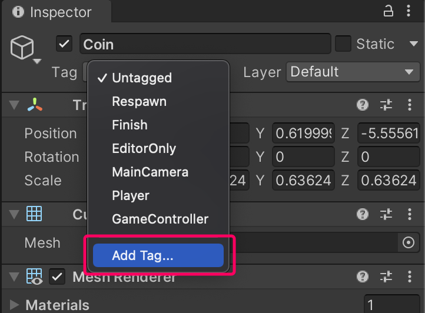
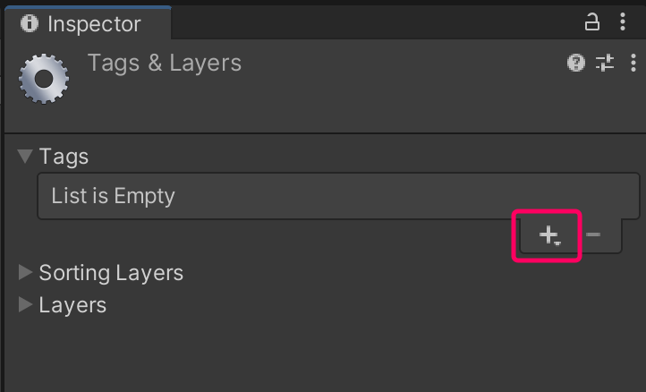
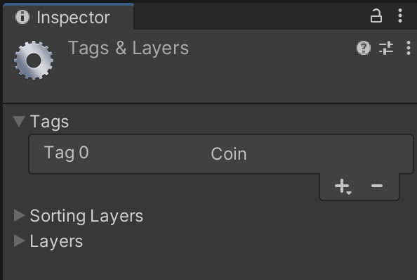
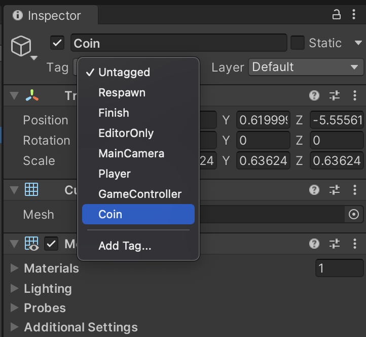

# 增加 Tag (標籤)

在 Unity 中，Tag 是個分類物件的好工具。藉由幫每個物件添加 Tag，之後就可以透過比對 Tag 來做判斷，比起判斷物件名稱，來得更通用。

### Tag 選單
Unity 中預設有一些常用的 Tag 名稱，我們也可自訂。

現在我們要再新增一個自訂標籤，所以按下 Tag 選單最後一項 Add Tag...

### 新增 Tag
這邊會開啟 Tag 選單，再藉由按下 ＋ 符號來新增名為 Coin 的標籤

新增完後就會顯示如下圖：

:::tip
此時只是在 Tag 列表中新增了項目，但原本的球體物件還沒套用這個 Tag 喔！
:::

### 套用 Tag
當新 Tag 成功建立時，還需要回到原本物件上，去套用該 Tag。
所以選取球體物件，此時的 Tag 下拉列表中就會出現我們剛才新增的 Coin 標籤了，選取。

場景上的其他得分物件也要如此辦理
 