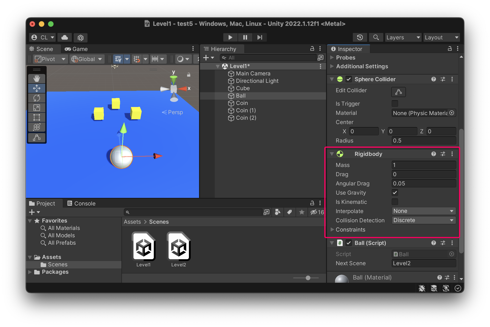

# 球體控制與碰撞

- 使用方向鍵輸入搭配 Rigidbody 推動球體。
- 並使用 OnTriggerEnter 碰撞事件做刪除＆過關判斷。

### 在球體上增加 Rigidbody
- 點選球體，按下 Add Component
- 選擇 Physics / Rigidbody



### 在球體上增加 Script
```csharp
using System.Collections;
using System.Collections.Generic;
using UnityEngine;
using UnityEngine.SceneManagement;

public class Ball : MonoBehaviour
{
    public string nextScene; // 下一個關卡的名稱（需回到Unity Inspector中輸入）
    Rigidbody rb;

    void Start()
    {
        rb = GetComponent<Rigidbody>();
    }

    void Update()
    {
        // 取得輸入方向數值
        float h = Input.GetAxis("Horizontal");
        float v = Input.GetAxis("Vertical");

        // 合成方向向量、轉換為推力
        Vector3 dir = new Vector3(h, 0, v);
        Vector3 move = dir.normalized * 100 * Time.deltaTime;
        rb.AddForce(move);
    }

    private void OnTriggerEnter(Collider other)
    {
        // 當碰撞到 tag 為 Coin 的物件
        if (other.gameObject.tag == "Coin")
        {
            // 刪除物件(設為停用、並移除)
            other.gameObject.SetActive(false);
            Destroy(other.gameObject);


            // 判斷是否過關
            // 先取得目前所有 Tag 為 Coin 的物件陣列
            GameObject[] objs = GameObject.FindGameObjectsWithTag("Coin");

            // 如果陣列長度為0 （陣列內沒東西）
            if (objs.Length == 0)
            {
                // 切換到下一關
                SceneManager.LoadScene(nextScene);
            }
        }
    }
}

```