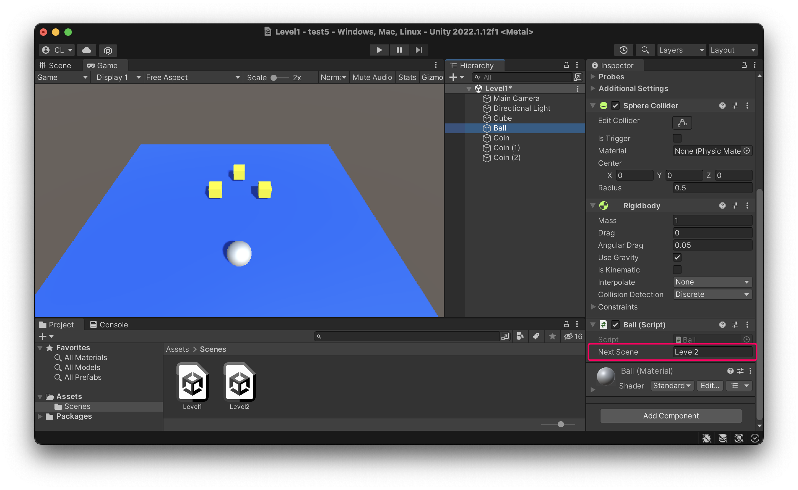
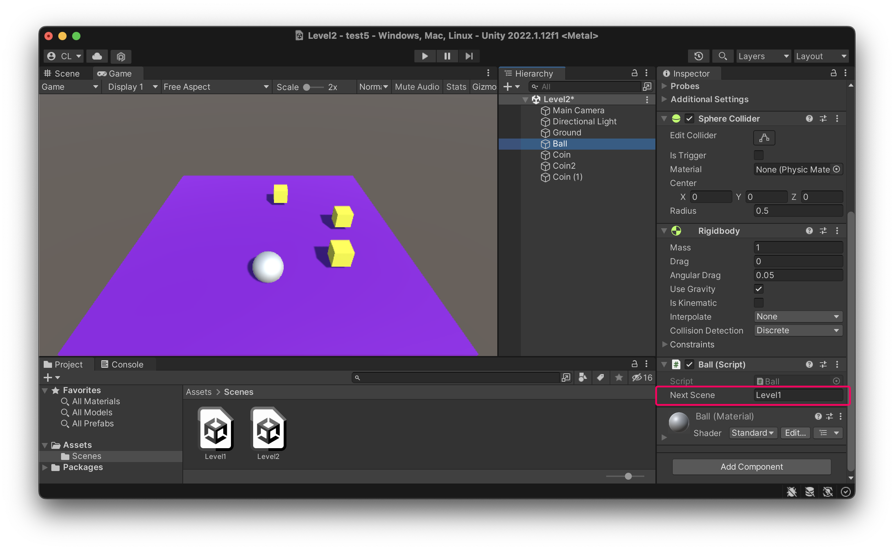

# 指定下一關

為了程式碼方便共用，上一章的程式中把下一關的場景名稱設定為 public 的文字屬性，這樣可以讓我們在 Inspector 視窗中自訂內容。

這樣的做法，大大的提升了這個 Ball 類別的通用性，到每個場景都可以直接使用，只需要在 Unity 中修改文字，而不需實際修改程式碼的內容。

### 在 Level1 中指定下一關名稱

### 在 Level2 中指定下一關名稱
