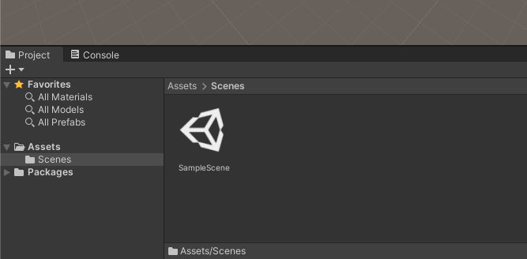
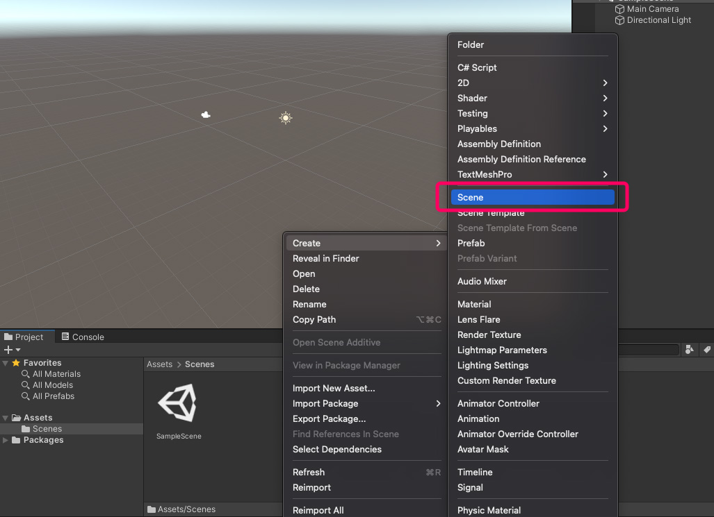
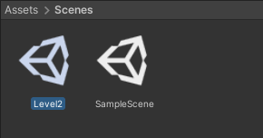
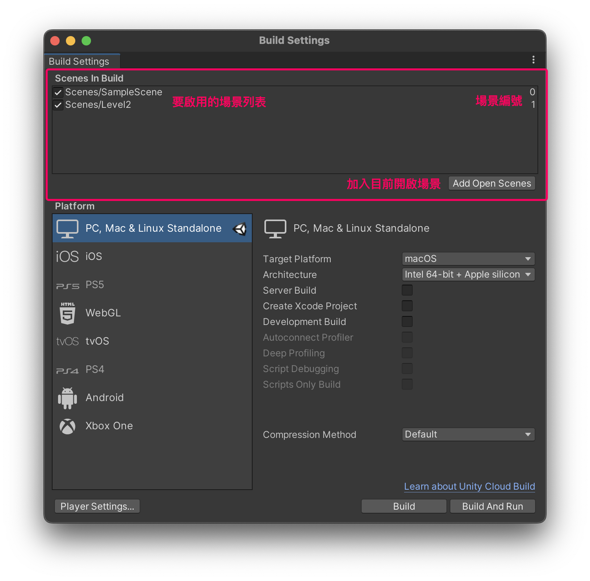
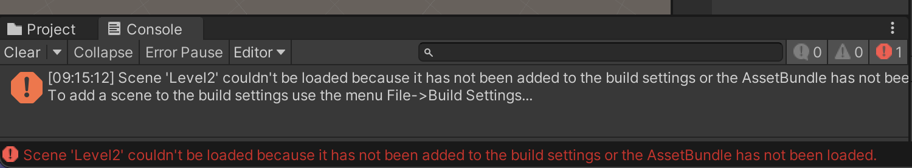

# 切換場景

## Unity 中的場景
在 Unity 裡，遊戲場景是以 .unity 檔案的形式存在。建議專案時，預設的場景就是：專案資料夾/Assets/Scenes/SampleScene.unity （如下圖）。一個檔案即是一個遊戲場景（關卡）。



## 建立新場景（下一關）
在 SampleScene 的旁邊按下右鍵，選擇 Create / Scene 就會產生一個新的場景檔，我們將先它命名為 Level2。





現在只要在場景檔上連點兩下，Unity 就會自動切換當前編輯的場景了。（離開原本場景時，請先存檔。）

## 啟用場景、並取得編號
在遊戲中想要切換場景，必須先啟用場景。這必須開啟 File / Build Settings 視窗 （如下圖）。




依序打開場景（回編輯畫面點兩下場景檔），並按下 Add Open Scenes 將當前開啟的場景都加入到列表中，前方有打勾表示已啟用。在右邊就可以看見場景編號。

:::danger 沒有啟用場景
如果沒有在 Build Settings 中啟用場景，到時在遊戲裡載入場景時，會出現以下錯誤訊息：

:::

:::tip 調整場景順序
在 Build Setting 裡也可通過拖曳改變場景順序。
- 開發時按下 Play 按鈕，Unity 會優先執行當前編輯的場景。
- 但輸出(Build)後執行遊戲，會優先開啟列表中第一個場景。 （通常是開始選單）
:::

## 在遊戲中切換場景
在遊戲裡切換場景必須要透過 Script 來達成，使用上很簡單。

```csharp
using System.Collections;
using System.Collections.Generic;
using UnityEngine;
using UnityEngine.SceneManagement; // 添加這行載入場景管理類別

public class NextSceneBtn : MonoBehaviour
{
    void Start()
    {

    }

    void Update()
    {

    }

    // 當碰撞(Trigger)發生時
    private void OnTriggerEnter(Collider other)
    {
        // 切換場景到 Level2
        SceneManager.LoadScene("Level2");
    }
}

```

:::tip LoadScene 的第一個參數
使用場景名稱、或場景編號皆可：
```csharp
SceneManager.LoadScene("Level2"); // 使用場景名稱
SceneManager.LoadScene(1); // 使用場景編號
```
:::
:::tip LoadScene 的第二個參數（選填）
第二個參數為選填，此參數只有兩個選項 LoadSceneMode.Single 或 LoadSceneMode.Additive。

在省略的時候 Unity 是預設使用 LoadSceneMode.Single。
| 第二參數 | 說明 |
| --- | --- |
| **LoadSceneMode.Single** | 關閉上一個場景，並開啟指定場景。（預設） |
| **LoadSceneMode.Additive** | 不關閉上一個場景，開啟指定場景，並在上一個場景之上顯示。 |

```csharp
SceneManager.LoadScene("Level2", LoadSceneMode.Single);
SceneManager.LoadScene("Level2", LoadSceneMode.Additive);
```
:::