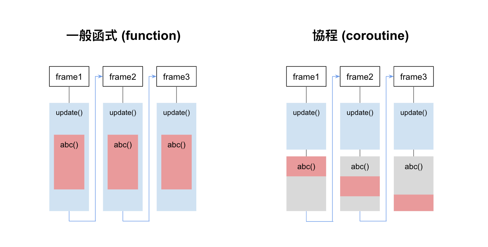

# 協程 Coroutine

傳統函式會一次從頭執行到尾。而 Coroutine (協程) 為可分段執行的函式，可在標記處中斷、下次再由中斷處繼續執行。(在 Update() 之後執行。)



:::tip
Coroutine 是 Unity 中最靈活的計時方法，雖然較難懂一點，但活用 Coroutine 可以讓程式碼更簡潔。**建議優先使用**
:::

[官方文件 MonoBehaviour.StartCoroutine](https://docs.unity3d.com/ScriptReference/MonoBehaviour.StartCoroutine.html)

## 使用方式
### 宣告 Coroutine 函式
```csharp
IEnumerator MyCoroutine()
{
    // 直接執行這裡...

    // 停兩秒
    yield return new WaitForSeconds(2);

    // 兩秒之後才執行這裡
}
```

:::tip IEnumerator 類別
Coroutine 函式宣告必須要定義回傳的類別為 IEnumerator。
:::


**Coroutine 內的其他時間控制寫法：**
```csharp
// 在該行暫停兩秒，之後再往後執
yield return new WaitForSeconds(2);

// 在該行暫停一個frame，下次再往後執行
yield return null;

// 在該行完全停止，不往後執行
yield break;
```

### 開始 Coroutine
通常是按下某個鍵，或碰撞到某東西而觸發。
```csharp
StartCoroutine(MyCoroutine());
```

### 結束 Coroutine

:::warning 使用變數儲存協程函式
由於每一次執行 MyCoroutine() 都會產生一個新的 IEnumerator 實例，因此為了要讓開始、結束都引用到同一個協程，所以就必須先將其儲存在變數中，之後才能重複呼叫到同一個協程函式。

（上面 StartCoroutine 的範例沒有其他應用，所以不用變數儲存、直接放入參數中即可）
:::

```csharp
// 為了能在 Stop 也取得同一個 Coroutine 函式，所以得先用變數存起來
// 通常放在 Start() 之中
IEnumerator mc = MyCoroutine();

// 開始 Coroutine
StartCoroutine(mc);

// 結束 Coroutine
StopCoroutine(mc);
```


## 範例：延遲 2 秒後刪除物件

```csharp
public class Coin : MonoBehaviour
{
    void Start()
    {
        // 開始執行 Coroutine
        StartCoroutine(DestroySelf());
    }

    void Update()
    {
        
    }

    // 宣告 Coroutine 要執行的內容
    IEnumerator DestroySelf()
    {
        // 先延遲兩秒，再執行後續的內容一次
        yield return new WaitForSeconds(2);
        gameObject.SetActive(false);
        Destroy(gameObject);
    }
}

```


## 範例：每 3 秒產生敵人（怪物箱）

```csharp
public class EnemyBox : MonoBehaviour
{
    public GameObject enemyPrefab; // 敵人Prefab用於複製（拖曳指定）
    private IEnumerator createEmenyCoroutine;

    void Start()
    {
        // 先產生 Coroutine 函式並裝在變數，供開始、結束使用。
        createEmenyCoroutine = CreateEnemyContinually();
        
        // 開始持續產生敵人
        StartCoroutine(createEmenyCoroutine);
    }

    void Update()
    {
        
    }

    void OnDestroy()
    {
        // 當此物件要刪除時，也一併停止 Coroutine
        StopCoroutine(createEmenyCoroutine);
    }

    // 持續產生敵人(Coroutine)
    IEnumerator CreateEnemyContinually()
    {
        // 無窮迴圈
        while (true)
        {
            // 停止 2 秒
            yield return new WaitForSeconds(3);

            // 產生隨機位置＆旋轉
            float rx = Random.Range(-10f, 10f);
            float rz = Random.Range(-10f, 10f);
            float rr = Random.Range(0, 360f);
            Vector3 randPos = new Vector3(rx, 0, rz);
            Quaternion randRot = Quaternion.Euler(0, rr, 0);

            // 產生敵人
            Instantiate(enemyPrefab, randPos, randRot);
        }
    }
}
```


## 範例：每 4 秒消失一個指定tag物件，直到碰到開關

```csharp
public class CoinsController : MonoBehaviour
{
    IEnumerator keepDelCoins;

    void Start()
    {
        // 將定時清除場上錢幣的 Coroutine 函式先用變數儲存，為了後續供 Start 和 Stop 使用
        keepDelCoins = RemoveTagObject("Coin", 4);

        // 開始定時清除場上錢幣
        StartCoroutine(keepDelCoins);
    }

    void Update()
    {
        
    }

    void OnTriggerEnter(Collider other)
    {
        // 當碰到關閉按鈕，就停止清除錢幣的 Coroutine
        if (other.tag == "StopButton")
        {
            StopCoroutine(keepDelCoins);
        }
    }

    // 定時清除指定tag物件 (Coroutine)
    IEnumerator RemoveTagObject(string tag, int sec)
    {
        // 無窮迴圈
        while (true)
        {
            // 停止指定秒數
            yield return new WaitForSeconds(sec);

            // 取得一個指定 tag 物件
            GameObject obj = GameObject.FindWithTag(tag);
            if (obj) 
            {
                // 刪除物件
                obj.SetActive(false);
                Destroy(obj);
            }
        }
    }
}
```