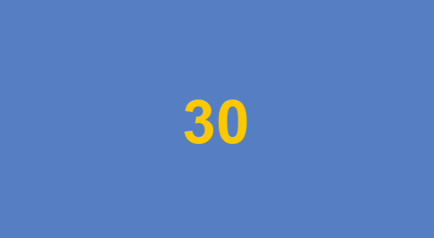

# 使用 Time.time 計時

Time.time 會回傳遊戲開始到現在所經過的秒數。可以在特定時間紀錄當下 Time.time 並在之後比對差異，進而得出經過的秒數。

通常用於遊戲時間的顯示、技能冷卻計算。

:::tip
Time.time 是個唯讀的變數，它由 Unity 引擎在每個 Frame 中累加，無法讓人任意更動或歸零。
:::


## 倒數時間顯示



```csharp
using System.Collections;
using System.Collections.Generic;
using UnityEngine;
using UnityEngine.UI; // 使用 Text 類別必須引入

public class LevelController : MonoBehaviour
{
    public Text countDownTxt; // 文字 UI 元件 (拖曳指定)

    private float sceneTimeMax = 30; // 倒數時間 30 秒
    private float sceneTimeStart = 0; // 記錄進入場景時的秒數

    void Start()
    {
        // 記錄進入場景時的秒數
        sceneTimeStart = Time.time;
    }

    void Update()
    {
        // 計算剩餘秒數
        float timeLeft = sceneTimeMax - (Time.time - sceneTimeStart);

        // 更新倒數計時 UI (四捨五入到小數第一位)
        countDownTxt.text = (Mathf.Round(timeLeft * 10) / 10).ToString();
    }
}
```
